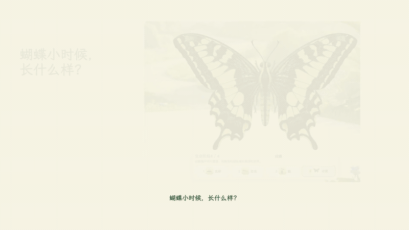

<div align="center">

[简体中文](README.md) · [English](README.en.md)


<h1>FrameLoom</h1>

**Give your agent a document. Turn it into a video with diagrams and animation.**

A document-to-video Skill for Codex, Claude Code, and other coding agents

[](https://acorn2.github.io/frame-loom/)
[](https://github.com/Acorn2/frame-loom/actions/workflows/ci.yml)
[](LICENSE)
[](package.json)

[See the results](#see-the-results) · [Make your first video](#quick-start) · [Browse styles](https://acorn2.github.io/frame-loom/) · [Installation and troubleshooting](references/installation.en.md)

</div>

**FrameLoom** lets a coding agent turn articles, scripts, and product documents into videos. The agent interprets your content and writes a script and storyboard; Remotion renders diagrams and animation on your computer. Start with a silent preview, then export clean visuals for an external editor or add voiceover to make a narrated video.

## See the results

**Real case: promotional copy and website screenshots become a 65-second narrated video for a children's nature museum.** The agent plans the script and shots, combining actual product screenshots, life-stage diagrams, and an access comparison. Generated text uses one font family; colors come from the product homepage.



[Full narrated review candidate](examples/nature-museum-case/previews/nature-museum-narrated.mp4) · [Case and sources](examples/nature-museum-case/README.en.md) · [Diagram animation example](examples/template-families/README.md) · [Browse six styles online](https://acorn2.github.io/frame-loom/)

The full sample has 19 scenes and real TTS narration. The GIF contains actual video excerpts and is silent. Rotation and zoom show screenshots after operations. This is an iterated review candidate; full playback and public asset-use rights still need review. Its source and narration are in Chinese. The agent plans new content for your own document.

## What can you make?

| Your source | Possible videos |
| --- | --- |
| Articles, notes, scripts | Knowledge explainers, viewpoints, and methods |
| Product documents and real screenshots | Feature explanations, steps, and workflows |
| Reports and sourced data | Summaries, comparisons, processes, and data diagrams |

For creators who already use Codex, Claude Code, or another coding agent and want to turn written material into explainers. **v0.5 is a public beta.** The supported visuals focus on text, diagrams, and real assets; live action, narrative films, and complex 3D scenes are outside the current scope.

## Quick start

### 1. Install and open your agent

Prepare **Git, Node.js 24+, and FFmpeg / ffprobe**. Node.js 24 LTS is recommended. Follow the [installation guide](references/installation.en.md) if you need setup commands or version checks.

```bash
git clone --depth 1 https://github.com/Acorn2/frame-loom.git
cd frame-loom
npm ci
```

Open the entire `frame-loom` repository in your coding agent:

| Agent | How to use it |
| --- | --- |
| Codex | Start a session in this repository and ask it to use the frame-loom Skill |
| Claude Code | Run `claude --plugin-dir .` from the repository root, then invoke `/frame-loom:frame-loom` |
| Other coding agents | Ask it to read the root [SKILL.md](SKILL.md) and execute commands from this directory |

The first silent preview needs no TTS configuration or API key. The first render may download a browser. Prepare access to your chosen coding agent separately; its charges depend on that service.

<details>
<summary>Check rendering first: use the prepared sample without an agent</summary>

Run in your terminal:

```bash
npm run render:storyboard -- examples/creator-production-pilot/storyboard.json .tmp/quick-start/preview-silent.mp4 --mode fast
npm run inspect:output -- .tmp/quick-start/preview-silent.mp4 examples/creator-production-pilot/storyboard.json
```

After `OUTPUT OK`, open `.tmp/quick-start/preview-silent.mp4` in a local player. Expect a 1920×1080, 30 fps, 20-second silent video. The output directory is created automatically. Use a new filename when repeating this run. This route uses an existing storyboard; continue below to try document planning.

</details>

### 2. Try the bundled document

You do not need your own source file yet. Paste this into the **agent chat**:

```text
Use the frame-loom Skill to read examples/creator-production-pilot/source/source.md.
Make a 16:9 silent preview in Editorial Ink style (retro-zine).
Use fast mode, recommend shots from the document, and continue production directly.
Report the actual video path, duration, and check results, then open it for me to watch.
```

The agent creates a `projects/YYYYMMDD-topic/` project, preserves the source, writes the script and storyboard, renders, and runs QA. **The successful result is that project's `output/preview-silent.mp4`, with its actual duration and check results.** It has a review marker and no audio; the new video's content and duration depend on the agent's plan.

You do not need to write JSON, create project directories, or select every shot. After watching, tell the agent which scene to change and continue in the same project.

### 3. Use your own material

Replace the placeholder with a path to an existing Markdown or plain-text document, or attach the file:

```text
Use the frame-loom Skill to turn <document path> into a landscape silent preview.
Recommend a style and shots from the content, use fast mode, and continue production.
Report the video path, duration, and check results.
```

Attach product screenshots if available, or provide an exact URL for the agent to capture. Subject-product screenshots guide the colors by default, while the style controls composition and motion. Ask to “use the style's default colors” if you prefer. To review before rendering, request “review mode: show the script and storyboard, then wait for my approval.”

## Choose a style

Six styles use the same storyboard for comparison. These frames show the completed diagrams; the links open actual silent samples.

| Editorial Ink | Signal | Sketch Notes |
| --- | --- | --- |
|  |  |  |
| [Watch sample](examples/template-families/previews/retro-zine-semantic.mp4) | [Watch sample](examples/template-families/previews/signal-semantic.mp4) | [Watch sample](examples/template-families/previews/scatterbrain-semantic.mp4) |

| Swiss Blue | Blueprint | Product Frame |
| --- | --- | --- |
|  |  |  |
| [Watch sample](examples/template-families/previews/archive-grid-semantic.mp4) | [Watch sample](examples/template-families/previews/signal-noir-semantic.mp4) | [Watch sample](examples/template-families/previews/studio-frame-semantic.mp4) |

Choose a style in the [online library](https://acorn2.github.io/frame-loom/), copy its production prompt, and give it to your local agent with a document. The agent recommends shots from the content by default; manual selection is available. The website displays public samples; production runs in your local project.

## Continue from preview to finished video

| Desired result | Next step and output |
| --- | --- |
| A narrated video | Configure one of [Doubao, OpenAI, ElevenLabs, Alibaba, or MiniMax (Chinese guide)](references/tts-setup.md), or provide matching external voiceover; output: `output/pilot-audio.mp4` |
| Clean visuals for an external editor | Ask for a visual master; output: `output/visual-master-vNNN.mp4`, without audio, narration captions, or review markers, plus script and shot timings |
| Record voiceover before making visuals | Ask for a script handoff; output: `output/script-handoff/`, then bring your recording back |

Once TTS is configured, continue in the same project:

```text
Continue with a narrated version in the project we just created, using configured real TTS.
If several configurations are available, let me choose one.
Align the visuals to the measured voiceover duration, render, and run QA.
```

See the [usage guide (Chinese)](references/usage-guide.md) for configuration, external voiceover, and approval. Narrated deliveries and visual handoffs require your full playback review. Automated QA does not verify every fact, pronunciation, or visual decision.

## Common questions

**Do I need to write code or storyboard JSON?** No manual authoring is required. You need to install local tools, use a coding agent, and check its output. The CLI and JSON are the agent's working interface.

**Do I need voiceover? Are there charges?** The first silent preview needs no voiceover. Configure just one TTS provider if you want narration. Agent and TTS charges depend on their services; local rendering does not call a generative video API.

**Does it support portrait video?** All six styles and 40 scene recipes work in 16:9 landscape. 9:16 portrait supports four recipes: semantic diagrams, type and filter, AI response generation, and unit-dot regrouping. Fonts are independently selectable; see the [font catalog (Chinese)](fonts/README.md).

**Are documents uploaded to the library website?** The website does not receive documents. Rendering is local; your chosen agent or TTS service may receive source content or narration according to its configuration and terms.

**What if setup fails or the result needs improvement?** Start with [troubleshooting](references/installation.en.md#troubleshooting). Then submit a [setup or runtime issue](https://github.com/Acorn2/frame-loom/issues/new?template=setup-problem.yml) or [video feedback](https://github.com/Acorn2/frame-loom/issues/new?template=video-feedback.yml).

## Guides and contributions

- [Installation and troubleshooting](references/installation.en.md): English instructions for local tools, the first render, and agent loading.
- [Usage guide](references/usage-guide.md), [TTS setup](references/tts-setup.md), and [screenshot colors](references/project-palette.md): detailed guides, currently in Chinese.
- [Shared Skill](SKILL.md): English agent workflow. [Shot catalog](shots/README.md) and [storyboard contract](references/storyboard-schema.md): technical references, currently in Chinese.
- [Contributing](CONTRIBUTING.md), [changelog](CHANGELOG.md), and [security reporting](SECURITY.md).

<details>
<summary>Developers: current shot capabilities</summary>

The runtime registers 40 scene recipes, 9 hosted actions, and 5 chapter transitions; 48/48 shortlist candidates are adapted. Scene recipes and presets remain experimental. The [capability manifest](src/renderer/capability-manifest.ts) defines supported combinations. See the [optional explainer preset](video-templates/retro-zine-explainer/guide.md) and [local library guide](library/README.md) for technical details (Chinese).

</details>

## Credits and licenses

- [Remotion](https://www.remotion.dev/) provides deterministic video rendering with React.
- [video-shotcraft](https://github.com/Vincentwei1021/video-shotcraft) informed shot recipe methods and the presentation structure. Individual `provenance.json` files and the [coverage ledger](shots/shortlist-coverage.json) record sources and adaptation licenses.
- Bundled fonts retain original copyright notices and SIL OFL 1.1 licenses; see the [font directory](fonts/README.md).

FrameLoom's own code is [MIT licensed](LICENSE). Remotion has a separate [official license](https://www.remotion.dev/license). Fonts, images, music, and TTS output follow their own terms; FrameLoom's MIT license does not replace them.

Maintained by **Hresh赫什**, an independent developer building products with AI. See other projects and experiments on the [personal website](https://hreshhao.com/).
