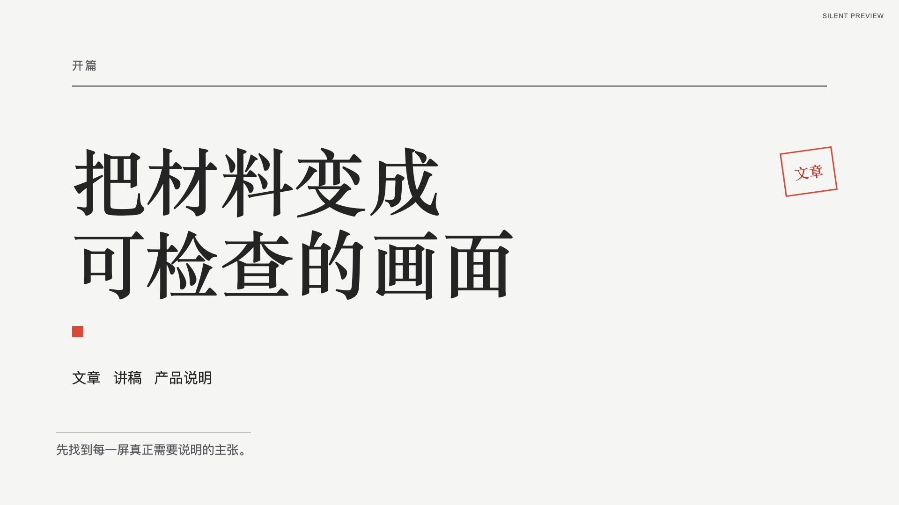
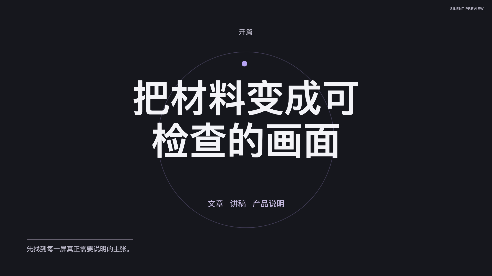
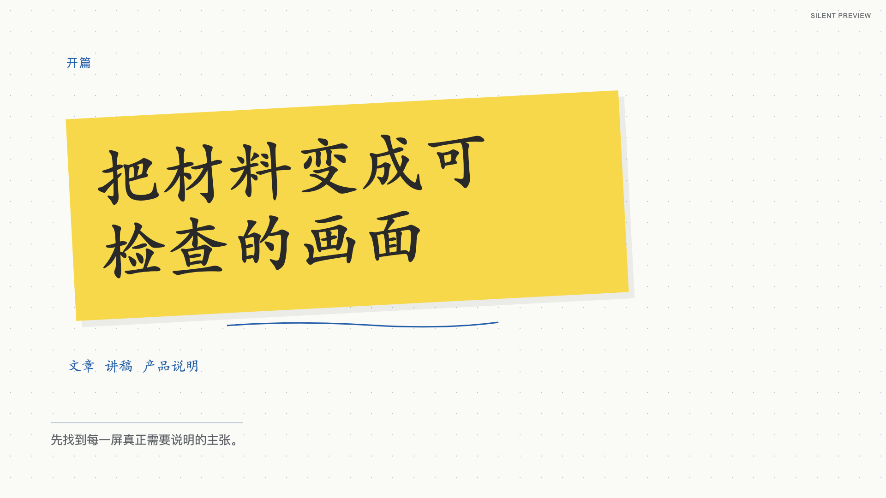
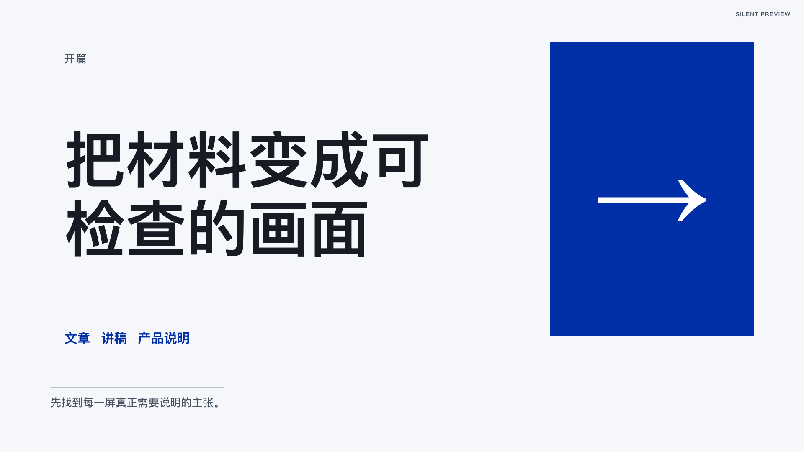
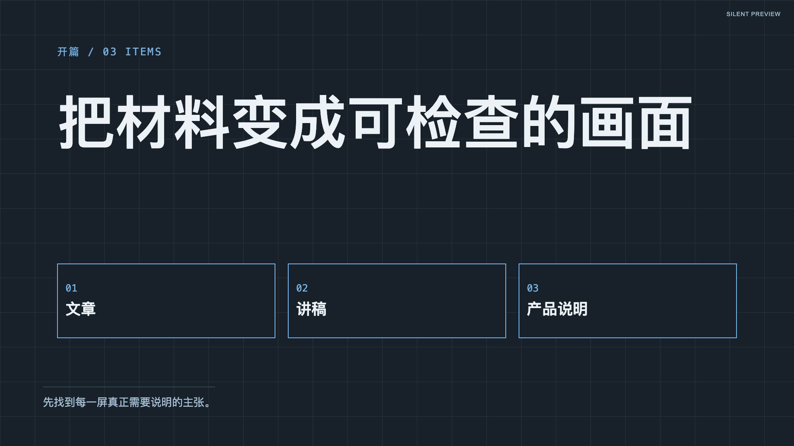
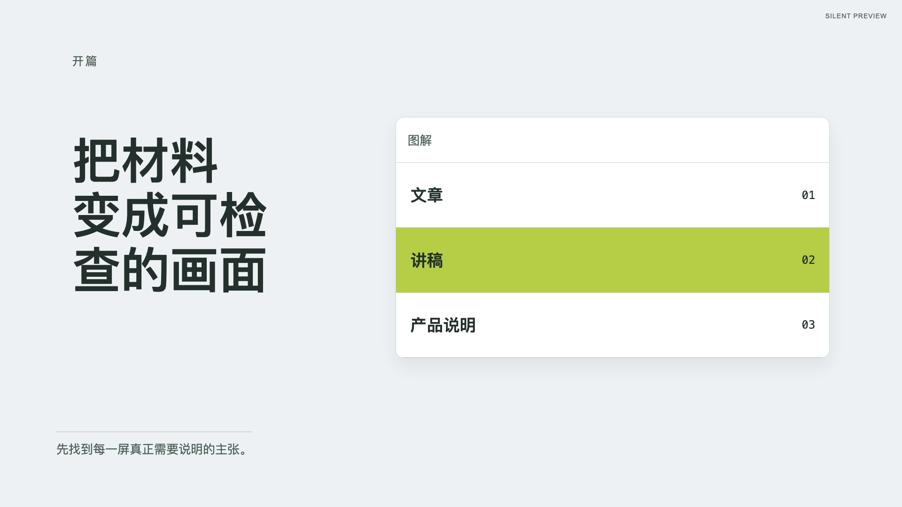

<div align="center">

[简体中文](README.md) · [English](README.en.md)


<h1>FrameLoom</h1>

**用 AI 将文档变成视频**

Document-to-Video Skill for Coding Agents

[](https://acorn2.github.io/frame-loom/)
[](https://github.com/Acorn2/frame-loom/actions/workflows/ci.yml)
[](LICENSE)
[](package.json)
[](https://github.com/Acorn2/frame-loom/stargazers)

**6 套视频风格 · 37 个场景配方 · 5 套中文字体 · 静音预览 / 干净底片 / 有声视频**

[在线预览](https://acorn2.github.io/frame-loom/) · [快速开始](#快速开始) · [使用指南](references/usage-guide.md) · [参与开发](CONTRIBUTING.md)

</div>

**FrameLoom** 是以 Codex 为主要入口、兼容 Claude Code 等 Coding Agent 的本地视频生产 Skill。提供文章、讲稿或产品说明后，Agent 负责理解内容、编写讲稿和分镜，Remotion 负责校验与渲染。你可以先看静音预览，再决定导出供剪辑软件使用的干净画面底片，或接入 TTS／已有旁白制作项目内有声视频。

适合知识讲解、产品说明、报告摘要和数据解释。当前为 **v0.5 公开测试阶段**。Agent 生成的观点与事实需要创作者核对；自动 QA 后，底片交接和有声成片仍需要人工完整播放复核。

**[浏览风格与镜头配方 →](https://acorn2.github.io/frame-loom/)** 先选风格、复制制作指令，再回到本地 Agent 提供文档；默认根据文档推荐镜头组合，也可手动限定。网页只展示公开样例，不上传文档或执行视频生产。

```text
文档 / 文档＋图片 → Agent 编写讲稿与分镜 → 校验与 Remotion 渲染 → 预览 / 底片 / 有声视频 → QA 与人工复核
```

## 效果展示

下面是实际 Remotion 渲染的六套风格。它们使用[同一份公开分镜](examples/template-families/storyboard.semantic.json)，每套 7 个镜头、50.8 秒；截图与链接中的视频均为静音审片示例。

| 墨白杂志 · Editorial Ink | 暗场信号 · Signal | 手绘便签 · Sketch Notes |
| --- | --- | --- |
|  |  |  |
| [观看静音样片](examples/template-families/previews/retro-zine-semantic.mp4) | [观看静音样片](examples/template-families/previews/signal-semantic.mp4) | [观看静音样片](examples/template-families/previews/scatterbrain-semantic.mp4) |

| 瑞士蓝 · Swiss Blue | 工程蓝图 · Blueprint | 产品演示 · Product Frame |
| --- | --- | --- |
|  |  |  |
| [观看静音样片](examples/template-families/previews/archive-grid-semantic.mp4) | [观看静音样片](examples/template-families/previews/signal-noir-semantic.mp4) | [观看静音样片](examples/template-families/previews/studio-frame-semantic.mp4) |

更完整的案例与输入见[纯文档试点](examples/creator-production-pilot/README.md)、[资料笔记](examples/video-templates/knowledge-notes/README.md)和[演示产品更新](examples/video-templates/product-update/README.md)。公开样片用于选型，使用你的文档时会另建项目并编排专属内容。

## 快速开始

### 1. 安装项目

准备 **Node.js 24+**（推荐 24 LTS）及 **FFmpeg / ffprobe**，然后执行：

```bash
git clone https://github.com/Acorn2/frame-loom.git
cd frame-loom
npm ci
```

在该仓库打开 Coding Agent：

- **Codex**：直接说“使用 frame-loom Skill”，仓库内的 [Skill 入口](.agents/skills/frame-loom/SKILL.md)会加载共享流程。
- **Claude Code**：在仓库根目录运行 `claude --plugin-dir .`，使用项目内的[插件清单](.claude-plugin/plugin.json)。
- **其他 Coding Agent**：让 Agent 先读取根目录 [SKILL.md](SKILL.md)，所有命令从仓库根目录运行。

首次渲染可能下载 Remotion 使用的浏览器。遇到环境问题，可按[贡献说明](CONTRIBUTING.md)检查 Node.js、FFmpeg 与命令输出。

### 2. 给 Agent 一篇文档

在 **Agent 对话框**中输入下面的指令，将占位路径换成现有 Markdown 或纯文本文档的绝对路径。下面以墨白杂志风格为例，镜头由 Agent 根据文档推荐：

```text
请使用 frame-loom Skill，将 <文档绝对路径> 制作成 16:9 横屏静音审片预览。
视频风格：retro-zine
请根据原文推荐兼容的镜头组合并逐场编排，说明来源、画面表达与选择理由；不按分类凑齐。
简要展示组合后直接继续制作，不增加确认步骤。
使用 fast 模式，保留原文，完成讲稿、Storyboard 2.4、校验、渲染和 QA。
完成后告诉我实际项目路径、preview-silent.mp4 路径、视频时长和 QA 结果。
```

你不需要先写 JSON、创建项目目录或配置配音。Agent 会按 `YYYYMMDD-内容主题` 建立新项目；成功后返回 `preview-silent.mp4` 的实际路径、代表帧、时长和 QA 结论。这个带审片标记的视频仅供检查画面。之后可在同一项目继续制作底片或有声版。

需要手动限定时，列出“可用镜头配方：<ID列表>”，Agent 只在集合内编排。自动推荐与渲染前内容检查见[镜头编排](references/shot-planning.md)。有图片时附上本地路径；需要截图时提供准确网址。要先审分镜，把“fast 模式”改为“使用 review 模式，先给我审核讲稿、分镜和时间安排；我确认后再渲染”。

### 可选：先从网页挑选效果

打开[在线配方库](https://acorn2.github.io/frame-loom/)，选择 **视频风格 → 制作设置**，默认由 Agent 根据文档选镜头；也可到镜头页手动限定集合，复制制作指令并粘贴到本地 Agent 对话框，再附上文档。只使用本项目制作视频，无需启动配方库的本地网页服务；文档和视频生产仍在本地进行。

## 包含哪些能力

| 内容 | 当前可用能力 |
| --- | --- |
| 视频风格 | 6 套 Style Pack，分别组织配色、构图与基础动效；[查看风格](#六套视频风格) |
| 场景配方 | 37 个独立场景，覆盖标题、要点、对照、关系、流程与数据表达；[查看配方](shots/README.md) |
| 附属效果 | 9 个宿主动作、5 个换章配方；宿主动作依附指定镜头，不能作为独立场景 |
| 全片字体 | 思源黑体、思源宋体、霞鹜文楷、得意黑、小赖字体；独立单选，配有 30 组横屏风格×字体参考样片 |
| 预设组合 | `retro-zine-explainer` 提供可选的横屏知识讲解组合；[选用说明](video-templates/retro-zine-explainer/guide.md) |
| 输出路线 | 静音审片预览、干净画面底片、讲稿交接、TTS 或外部配音的项目内有声视频 |
| 本地生产 | Storyboard 契约、素材来源校验、渲染记录、QA 报告与审核指纹；[共享流程](SKILL.md) |
| 配方库网页 | 浏览真实样片、选择组合和复制制作指令，可本地运行或由 GitHub Pages 托管 |

当前运行时：37 个场景配方、9 个宿主动作、5 个换章配方；筛选清单接入 48/48。

横屏 16:9 的 37 个场景配方支持全部六套当前风格；竖屏 9:16 目前仅支持基础 `semantic-default` 配方。场景配方与预设组合仍为 experimental，实际选用以[能力清单](src/renderer/capability-manifest.ts)为准。

## 六套视频风格

| 风格 | ID | 适合的内容 |
| --- | --- | --- |
| [墨白杂志 / Editorial Ink](styles/retro-zine/preview.md) | `retro-zine` | 观点文章、知识解释、故事 |
| [暗场信号 / Signal](styles/signal/preview.md) | `signal` | 核心观点、转折、重点说明 |
| [手绘便签 / Sketch Notes](styles/scatterbrain/preview.md) | `scatterbrain` | 学习笔记、方法拆解、灵感整理 |
| [瑞士蓝 / Swiss Blue](styles/archive-grid/preview.md) | `archive-grid` | 报告、分析、结构化方法论 |
| [工程蓝图 / Blueprint](styles/signal-noir/preview.md) | `signal-noir` | 系统、机制、技术流程 |
| [产品演示 / Product Frame](styles/studio-frame/preview.md) | `studio-frame` | 产品说明、教程、工作流 |

风格与字体独立选择；选定镜头集合后，Agent 可以重复、重排或只使用其中一部分，不会自动加入未选镜头。字体来源与固定版本见[字体清单](fonts/README.md)，手动初始化示例见[使用指南](references/usage-guide.md#风格--多镜头配方24)。

## 选择交付结果

| 你想得到什么 | 交付物与完成条件 |
| --- | --- |
| 先检查画面 | `preview-silent.mp4`：静音审片预览，带审片标记 |
| 在剪辑软件里继续制作 | `visual-master-vNNN.mp4`：无音轨、无旁白字幕和审片标记，附讲稿与逐镜时间表；完整视觉复核后完成画面交接 |
| 先录音，再回流制作 | `output/script-handoff/`：讲稿与分镜，第一阶段不生成 MP4 |
| 在 FrameLoom 内完成有声视频 | `pilot-audio.mp4`：接入 TTS 或匹配的外部旁白；自动 QA 后仍需完整播放复核 |

`fast` 直接推进当前阶段，`review` 在渲染前增加讲稿与分镜审核；两种模式都能选择上述输出。自动 QA 通过不等于成片已经人工验收。底片在外部剪辑完成的视频由外部流程验收。

TTS 支持豆包、OpenAI、ElevenLabs 和阿里百炼；只配置实际使用的一家，也可提供已有旁白与 SRT/VTT。配置样例默认关闭，密钥通过环境变量读取。音频缺失或不匹配时会说明缺口，不把静音或 mock 语音作为有声交付。步骤见[使用指南](references/usage-guide.md#6-接入音频制作项目内有声视频)与[音频接入说明](references/audio-integration.md)。

## 仓库结构

```text
frame-loom/
├── SKILL.md                 # Coding Agent 共享生产流程
├── .agents/skills/          # Codex 自动发现入口
├── .claude-plugin/          # Claude Code 插件元数据
├── src/                     # Remotion、分镜类型、校验与 renderer
├── schemas/                 # 对外 JSON Schema 契约
├── shots/                   # 场景、宿主动作与换章配方及来源
├── video-templates/         # 可选的预设组合
├── styles/                  # 视频风格包
├── fonts/ & public/fonts/   # 字体清单、文件与原始许可
├── library/                 # 配方库网页、字体示例与产品图标
├── examples/                # 公开文档、分镜与示例画面
├── scripts/                 # 校验、初始化、渲染与 QA 入口
├── references/              # 使用指南与生产契约
└── projects/                # 本地用户项目，不提交到 Git
```

## 文档与参与开发

- [使用指南](references/usage-guide.md)：制作路线、字体选择、CLI、配音配置与交付审核。
- [Skill 流程](SKILL.md)与[Storyboard 契约](references/storyboard-schema.md)：Agent 编排与渲染输入约束。
- [质量生产说明](references/quality-production.md)：实测音频时间、字幕调整与镜头质量。
- [配方库本地运行与 Pages 发布](library/README.md)：需要本地浏览或维护配方库时，查看服务启动、预览生成及静态站点部署说明。
- [贡献说明](CONTRIBUTING.md)、[变更记录](CHANGELOG.md)与[安全反馈](SECURITY.md)。

本地修改可先运行 `npm run check:docs`、`npm run validate:shots`、`npm run typecheck`、`npm run lint` 和 `npm test`。Runtime 改动还需渲染对应示例并复核实际画面；完整开发检查见贡献说明。

## 致谢与许可

- [Remotion](https://www.remotion.dev/)：提供基于 React 的确定性视频渲染能力。
- [video-shotcraft](https://github.com/Vincentwei1021/video-shotcraft)：镜头配方的方法参考，以及本 README 的展示结构参考；具体来源、适配范围和许可记录见各配方的 `provenance.json` 与[接入台账](shots/shortlist-coverage.json)。
- 项目内使用的开源中文字体：原始版权与 SIL OFL 1.1 许可保留在[字体目录](fonts/README.md)。

FrameLoom 自有代码采用 [MIT](LICENSE)。Remotion 使用独立的[官方许可](https://www.remotion.dev/license)，字体、图片、配乐和 TTS 输出按各自来源条款使用；本项目的 MIT 不替代这些许可。

## 作者

由 **Hresh赫什** 维护，持续实践用 AI 把想法做成产品。项目进展与其他实践见[个人网站](https://hreshhao.com/)。欢迎通过 [Issue](https://github.com/Acorn2/frame-loom/issues)反馈使用问题，或按贡献说明提交改进。

产品截图或准确网址还可作为全片配色参考；配色来源与视频风格、字体、镜头独立选择。支持自动判断、风格配色和跟随产品素材；首版限当前横屏配方，真实截图保持原貌。见[项目配色流程](references/project-palette.md)。
