# FrameLoom / 帧织

FrameLoom 是一个以 Codex 为主要入口、兼容 Claude Code、Kimi Code、OpenCode 等 Coding Agent 的结构化视频生产 Skill。它把 Markdown 或结构化内容转成经过人工审核、可重复渲染的 Remotion 视频。

当前 `v0.5` 已跑通“风格选择 → 项目初始化 → storyboard → 渲染 → QA”的本地闭环，并提供 `review` / `fast` 两种执行模式和可选、供应商无关的音频 pilot：

```text
style selection → storyboard → validation → Remotion → silent/audio preview → QA report
```

## 快速开始

需要 Node.js 20+。

### Agent 入口

- **Codex**：打开本仓库后，从 [`.agents/skills/frame-loom/SKILL.md`](.agents/skills/frame-loom/SKILL.md) 发现 `frame-loom` Skill。入口会引导 Agent 读取根目录的共享流程；新增入口后，请在新会话中使用。
- **Claude Code**：仓库保留 [插件清单](.claude-plugin/plugin.json)，根目录 [`SKILL.md`](SKILL.md) 是插件的单 Skill 入口。本地可用 `claude --plugin-dir .` 加载。
- **其他 Coding Agent**：让 Agent 直接读取根目录 [`SKILL.md`](SKILL.md)，并从仓库根目录执行命令。

```bash
npm install
npm run typecheck
npm test
npm run list:styles
npm run preview:styles -- /tmp/frame-loom-style-gallery.html
npm run preview:templates
npm run init:project -- my-video --style retro-zine --canvas landscape
npm run validate:storyboard -- examples/article-video/storyboard.json
npm run validate:assets -- examples/article-video/storyboard.json
npm run check:safe-area -- examples/article-video/storyboard.json
npm run render:storyboard -- examples/article-video/storyboard.json /tmp/frame-loom-preview.mp4
npm run qa:storyboard -- examples/article-video/storyboard.json /tmp/frame-loom-preview.mp4 /tmp/frame-loom-review
```

`init:project` 只创建项目目录和占位草稿，不能直接产出视频。把原始 Markdown 放在 `projects/my-video/source/source.md`，然后让 Codex 使用 `frame-loom` Skill（其他 Agent 读取根目录 `SKILL.md`），完成内容提炼、脚本、风格选择、素材登记和 `storyboard.draft.json`。人工审核后写出状态为 `reviewed` 的 `storyboard.json`，再运行：

```bash
npm run produce -- projects/my-video --mode review
```

如果只需要自动化视觉预览，可在 Agent 完成有效草稿后运行 `npm run produce -- projects/my-video --mode fast`。`fast` 不会把空白占位草稿写成视频，也不代表人工审核通过。`preview:styles` 是轻量 token 画廊；`preview:templates` 用同一份公开分镜生成三套真实代表帧与静音短视频，结果写入新的 `projects/template-family-gallery-*` 目录，可加 `--portrait --stills-only` 只生成竖屏代表帧。`produce` 串联验证、素材、文字排版、音频时间轴、渲染和 QA，并写入 `run.json`。失败后可以用 `--from validation|assets|safeArea|render|qa` 恢复；相关输入或输出视频有变化时，指纹检查会要求从较早阶段重跑。独立 `render:storyboard` 同样执行渲染前检查。输出文件默认不覆盖，确认目标后才能用 `--force`。自动检查通过仍需完整播放复核。

内置示例：

- `examples/article-video/`：横屏 `retro-zine`
- `examples/product-demo/`：横屏 `retro-windows`
- `examples/data-explainer/`：竖屏 `scatterbrain`
- `examples/template-families/`：Storyboard 2.2 同内容模板对比素材与分镜

## 三套视频模板预览

下面三套使用[同一份公开分镜](examples/template-families/storyboard.json)：标题、步骤、数据、截图和字幕完全相同。图片均为 Remotion 实际渲染帧，可以直接比较模板如何安排信息；它们不是独立 HTML 效果稿。

| 模板 | 画面组织 | 动画节奏 |
| --- | --- | --- |
| **Retro Zine** | 暖纸与网格、编辑栏、分层纸卡；适合文字和证据较多的讲解 | 纸张滑入、逐条揭示、结论停留 |
| **Signal** | 深蓝黑舞台、青色焦点线、克制的横向信息秩序 | 短距离入场、节点依次点亮、平稳收束 |
| **Scatterbrain** | 点阵白板、彩色便签、错落但有顺序的内容区 | 便签错时贴入、轻微旋转后稳定 |

### Retro Zine · 编辑式讲解

开场用大标题建立主题；步骤和数据进入纸卡，真实截图保留独立画框，结尾回到一句明确结论。

| 开场 | 步骤 | 数据 |
| --- | --- | --- |
| 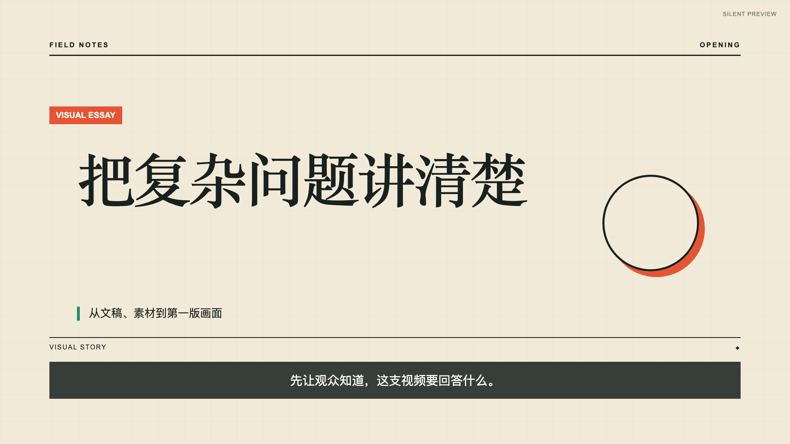 | 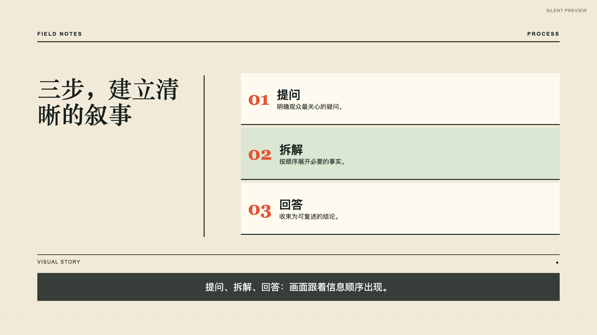 | 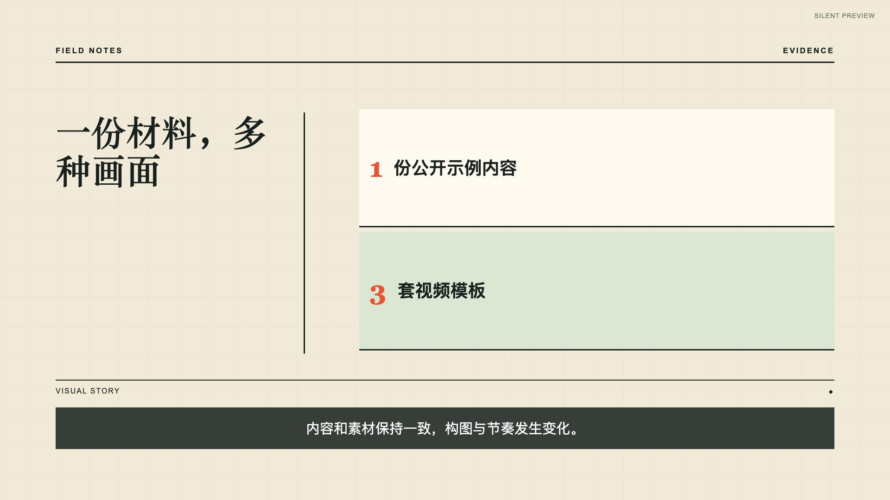 |

| 素材 | 结尾 |
| --- | --- |
| 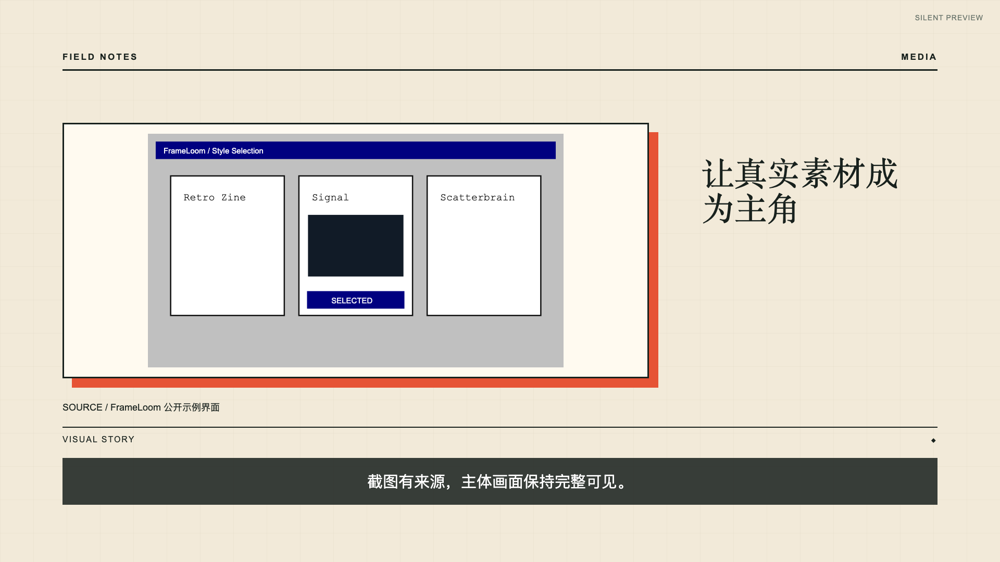 |  |

### Signal · 信息聚焦

深色画面把注意力放在标题和当前信息上；步骤与指标按阅读顺序排列，截图占据画面主体。

| 开场 | 步骤 | 数据 |
| --- | --- | --- |
|  | 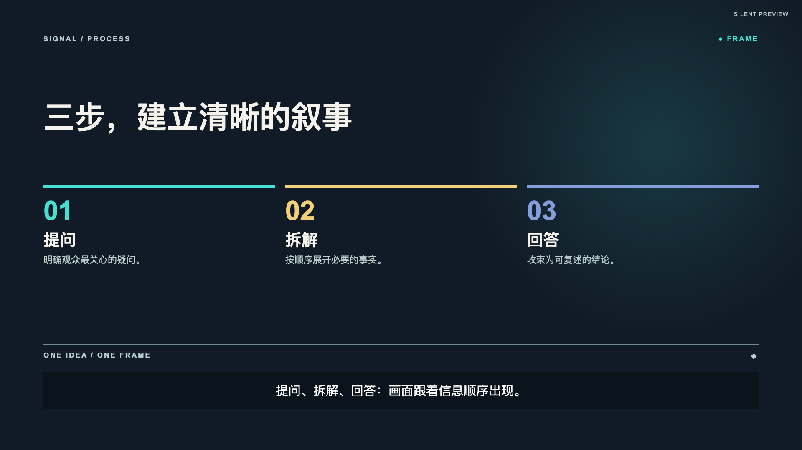 | 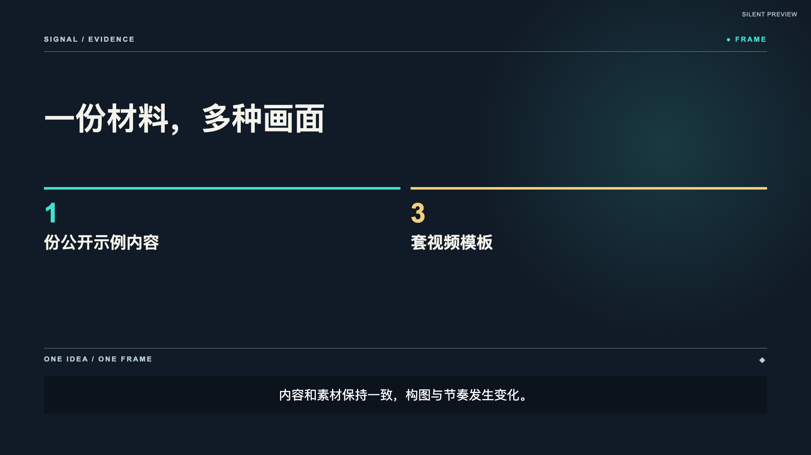 |

| 素材 | 结尾 |
| --- | --- |
| 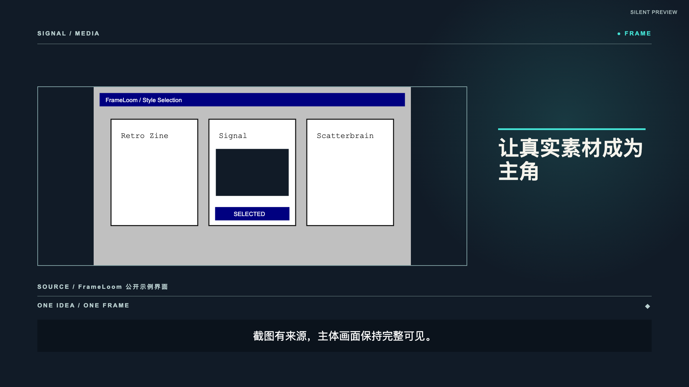 | 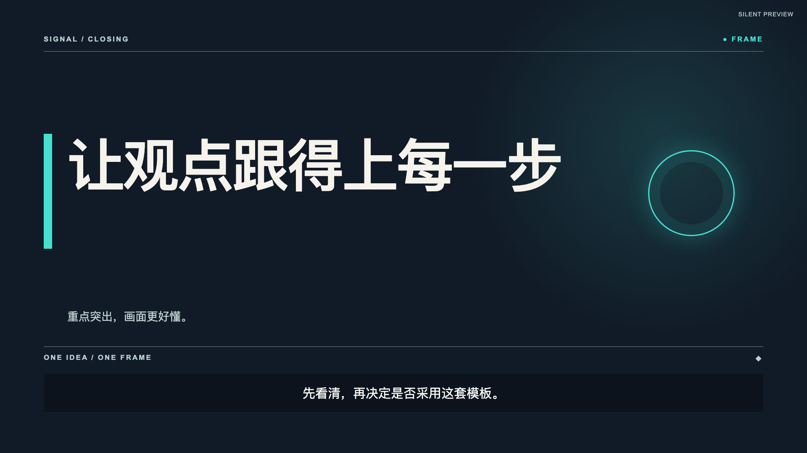 |

### Scatterbrain · 白板便签推演

内容像被逐步贴到白板上；便签颜色和位置区分信息，文字在入场后保持稳定，避免持续晃动。

| 开场 | 步骤 | 数据 |
| --- | --- | --- |
|  | 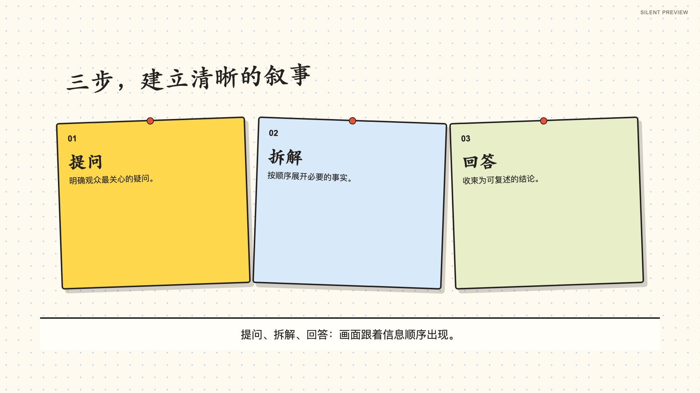 | 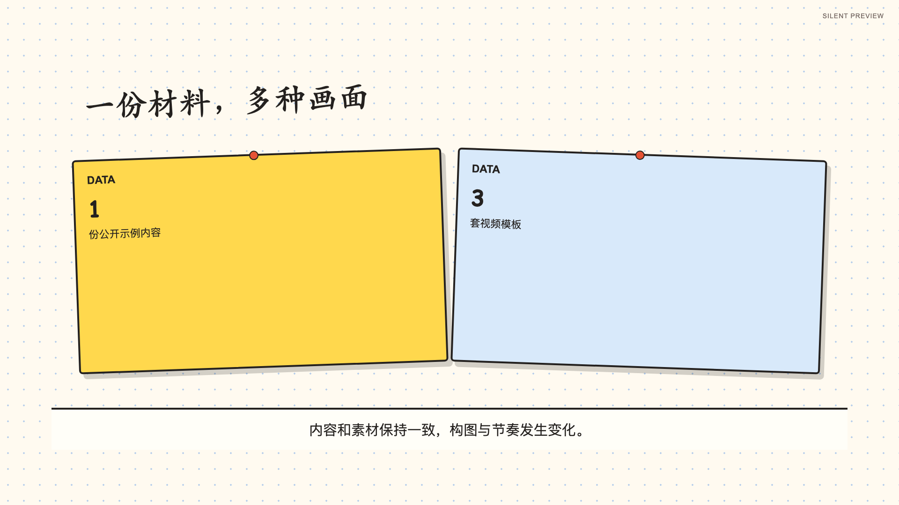 |

| 素材 | 结尾 |
| --- | --- |
| 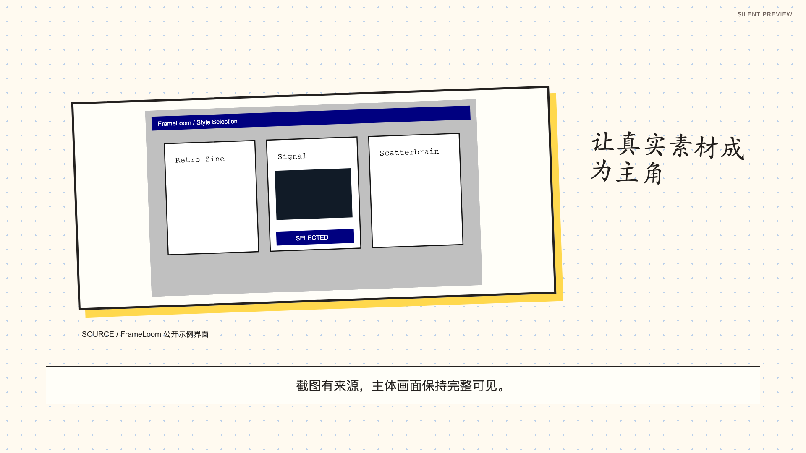 |  |

截图素材来自仓库内的公开示例，来源见[素材清单](examples/template-families/asset-manifest.json)。运行 `npm run preview:templates` 可在本地生成三支 15 秒静音样片、完整画廊和自动 QA 报告；生成目录位于被 Git 忽略的 `projects/` 下，README 只展示可随仓库保存的代表帧。样片不含旁白或音乐。

## 模板契约与能力

以下是分镜使用的底层场景组件，并非让用户再选一次的视频模板：

- `statement`：主张、标题和结论
- `graph-explainer`：节点关系和连线演进
- `metric-grid`：指标比较和数据摘要
- `interaction-flow`：真实产品截图的状态切换

新模板候选为 `retro-zine`、`signal`、`scatterbrain`：Storyboard 2.2 使用 `purpose` 声明开场、观点、步骤、数据、媒体或结尾，三套模板按职责分别计算版式与动作。`signal` 仍为 experimental。旧 `retro-windows` 标为 deprecated，保留 Storyboard 2.1 项目的加载与渲染。详细内容槽位及限制见 [`references/storyboard-schema.md`](references/storyboard-schema.md)。

视频质量契约支持场景主结论与焦点目标、节点的当前/完成状态、带来源声明的观察对象和局部放大框、显式重叠转场与结尾停留。QA 报告记录场景时间线、稳定停留帧数和焦点数量，并抽取关键动作与交接代表帧。旧 storyboard 未使用新字段时保留原有时长与转场行为；新字段与示例见 [`references/storyboard-schema.md`](references/storyboard-schema.md)。

可选音频不绑定 TTS 服务。准备本地音频、SRT/VTT 和 `audio-config.json` 后，先测量时间轴和响度再渲染：

```bash
npm run inspect:audio -- projects/my-video/storyboard.json projects/my-video/audio/audio-config.json
npm run render:storyboard -- projects/my-video/storyboard.json projects/my-video/output/pilot-audio.mp4 --audio-config projects/my-video/audio/audio-config.json
npm run qa:storyboard -- projects/my-video/storyboard.json projects/my-video/output/pilot-audio.mp4 --audio-config projects/my-video/audio/audio-config.json
```

维护者可以运行 `npm run test:audio-pilot`，使用临时生成的测试音频和字幕验证完整的 audio pilot 渲染与 QA 闭环；测试不会把音频文件写入仓库。

维护者可以运行 `npm run test:visual-regression`，渲染三个公开示例并检查三套 Style Pack、四类模板、横屏/竖屏和代表帧覆盖。首版输出 contact sheet 供人工复核，不使用像素快照替代完整播放。

## 工作边界

FrameLoom 适合知识讲解、产品流程、报告摘要、数据解释和文档汇报。它不承诺剧情片、真人表演、复杂 3D 或主要依赖生成式镜头的宣传片。AI 负责内容判断和 storyboard 草稿，程序负责时间轴、布局、动作和渲染；审核后的 `storyboard.json` 才能进入渲染。

音频扩展说明见 [`references/audio-integration.md`](references/audio-integration.md)。

## 许可证

MIT。Remotion 的使用和商业条款请在部署前按所安装版本核对官方许可说明。
