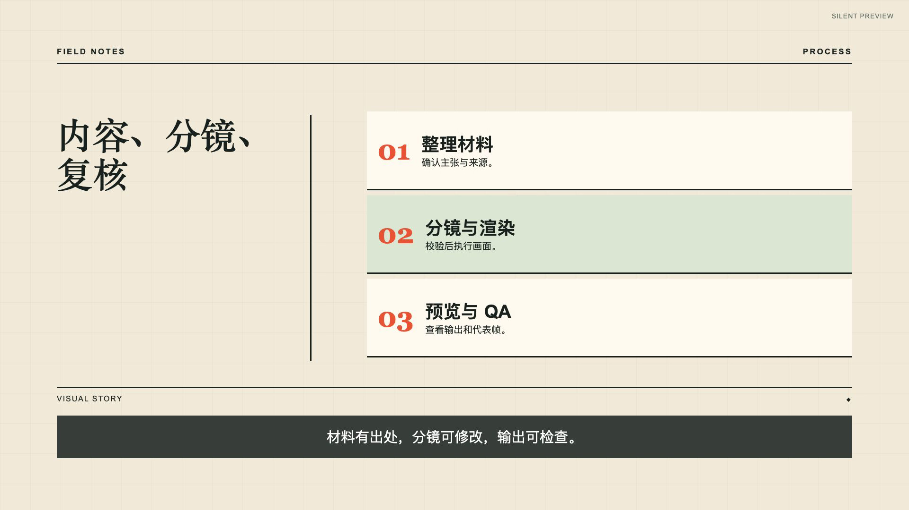
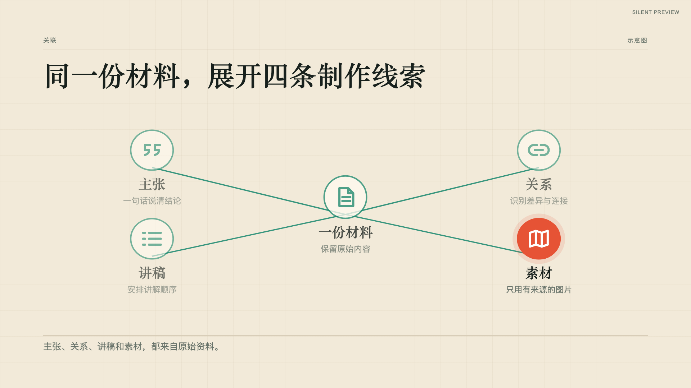
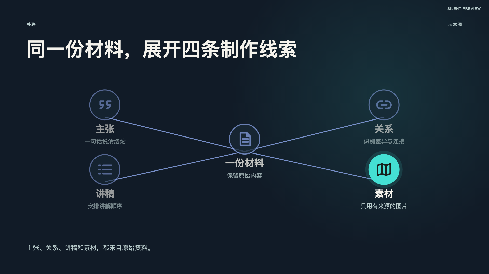
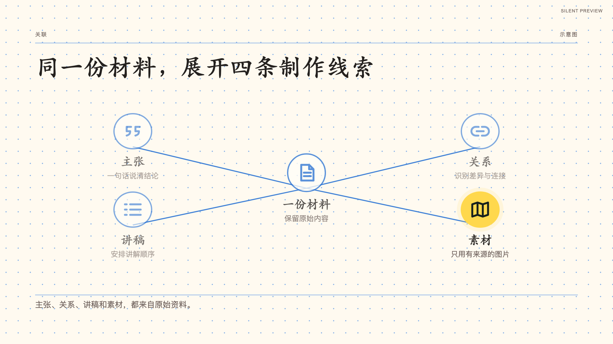
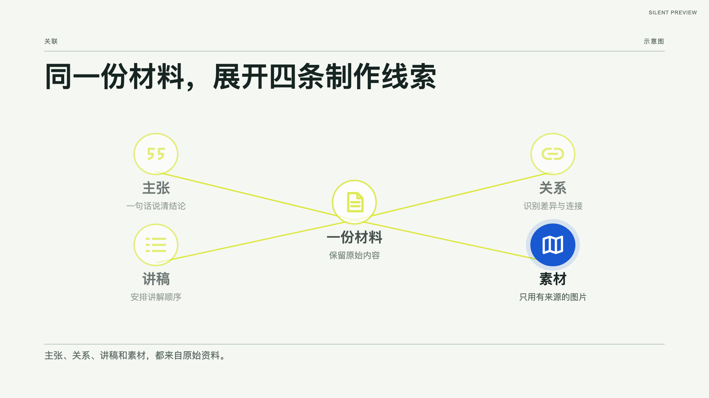
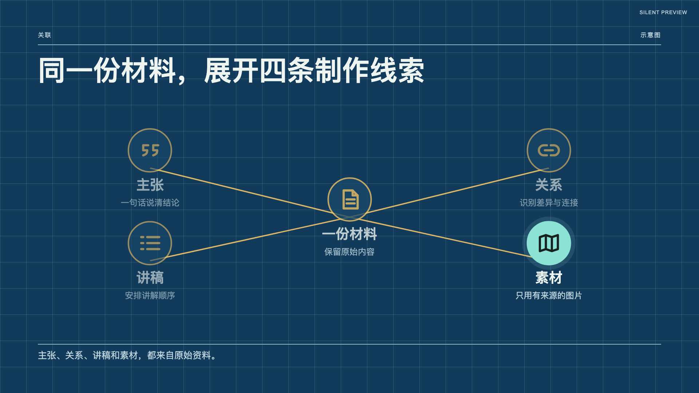
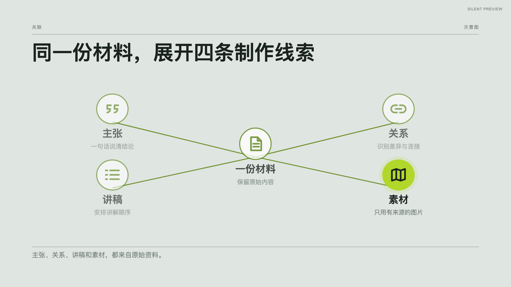

# FrameLoom / 帧织

FrameLoom 是一个以 Codex 为主要入口、兼容 Claude Code、Kimi Code、OpenCode 等 Coding Agent 的结构化视频生产 Skill。Agent 负责从文档提炼内容并编写分镜，Remotion 负责校验、渲染和 QA。

当前 `v0.5` 已跑通“文档 → 分镜 → 渲染 → QA”的本地闭环。`fast` / `review` 控制分镜审核；交付用途可选审片预览、供外部剪辑的干净画面底片或项目内有声视频。音频可来自内置 TTS 或用户提供的录音。

从**已有文档**（文章、讲稿或产品说明）开始即可。首次体验默认使用纯文档、横屏和静音预览；有本地图片或指定网页截图时可选择“文档＋图片”。主张提炼、画面路线和内容缺口由 Agent 判断，仍需创作者审阅；CLI 不会自动理解一篇文章。

```text
source document + selected image mode → claims and visible relationships → semantic storyboard → Style Pack → validation → preview / visual master / narrated video → QA report
```

**静音 MP4 有两种不同用途。**`preview-silent.mp4` 是带审片标记的画面预览；纯文档静音预览不会为了填充时间自动增加底部旁白字幕。`visual-master-vNNN.mp4` 是无音轨、无旁白字幕和审片标记的干净画面底片，可供创作者在剪辑软件里配音、叠加出镜画面和字幕。底片经完整视觉检查后可以完成 FrameLoom 的**画面交付**；外部剪辑完成的视频由外部流程验收。若要在 FrameLoom 内完成有声讲解视频，则必须接入匹配的旁白，完成音频与画面 QA，再完整播放人工复核。

## 第一次使用：给一篇文档，先看画面

准备 Node.js 20+ 和 FFmpeg，在仓库根目录运行 `npm install`，然后在这个仓库打开支持 Skill 的 Coding Agent。Codex 会从 [Skill 入口](.agents/skills/frame-loom/SKILL.md)加载共享流程；其他 Agent 可先读取根目录的 [SKILL.md](SKILL.md)。把下面一句中的路径换成**现有 Markdown 或纯文本文档的绝对路径**：

```text
请使用 frame-loom Skill，读取 <文档绝对路径>，先用 fast 模式制作静音视频预览，我想看看画面效果。
视频模板：请根据文档自动选择，并告诉我最终使用的模板名称和 ID。
```

不需要先配置 TTS、准备音频、起项目 ID、创建项目目录、复制文档或填写用途。Agent 会保留原文，按 `YYYYMMDD-内容主题` 创建不覆盖旧项目的新目录，根据内容选画面路线和模板，写讲稿与分镜，再运行 `fast + silent` 的校验、渲染和 QA。未指定图片时默认纯文档；未指定画幅时默认 16:9 横屏。自动选模板时 Agent 应说明实际选用项；片长由文档内容决定，初始草稿的 20 秒只是占位值。

成功后应直接收到**你这篇文档的** `preview-silent.mp4`、代表帧、实际时长及简短 QA 结论。它只供检查画面。后续可在同一项目导出干净底片、使用 TTS 或接入外部配音，无需重新输入文档。若明确要审分镜，把提示词中的“fast 模式”改为“先给我审核分镜，确认后再渲染”。只说“制作视频”而未表明目标时，Agent 会问一次：先看画面、交底片给后期，还是在项目内完成有声版。

有图片时也只需说出文档和素材，例如：“请读取 `<文档路径>`，结合 `<图片路径>` 做一版静音视频预览。”网页截图请给准确网址；截图失败时 Agent 会说明原因，不会伪造画面。需要比较模板、手动运行 CLI 或接入音频时，再阅读下文。

## 选择模板、模式和交付目标

用户只需给出材料和想得到的结果，**不需要知道项目 ID、填写 JSON 或运行 CLI**。先决定交付什么，再决定是否要在渲染前审核分镜；输入是纯文档还是文档＋图片，不影响下面的选择。

**视频模板可以由你指定，也可以让 Agent 推荐。**下文测试输入统一指定 `retro-zine`，这样比较 `fast`、`review` 和音频路线时，画面风格保持一致；把示例中的 ID 换成[六套模板](#六套视频模板)里的其他 ID，即可测试其他风格。想先看候选，可说“先根据文档推荐最多三套视频模板，说明差别，等我选定后再制作”。模板选择与 `fast`／`review`、音频来源、交付目标互不绑定。

**默认值要分清：**直接运行 `init:project` 且省略 `--style`，代码默认初始化 `retro-zine`；通过 Skill 给文档却不指定模板时，Agent 应按文档内容选一套，并告知实际模板 ID，不能假定一定是 `retro-zine`。`review` 应把选定模板放进分镜审核，`fast` 可按已说明的模板继续运行。

| 分镜模式 | 渲染前的停点 | 适合什么时候使用 |
| --- | --- | --- |
| `fast` | Agent 写好讲稿和分镜后自动校验、继续执行；中途不等分镜批准 | 首次试效果，或已经确定制作方向、希望连续完成当前阶段 |
| `review` | Agent 先展示讲稿、分镜、时间安排和画面预留区；你确认后记录当前版本的审核指纹，才能交讲稿或渲染 | 要先核对观点、镜头、字幕或后期叠加位置，再进入生产 |

`fast` 和 `review` **都能**制作下表中的任一种结果。`review` 不是音频开关；它只增加分镜审核停点。两者都要通过自动校验；底片交后期和项目内有声视频还各有一次**完整播放人工复核**。修改已批准的讲稿、分镜、素材、模板或画面预留配置后，需要展示变更并重新批准。

| 这一步要拿到什么 | 音频与阶段 | 主要文件 | `run.json` 的 `deliveryStatus` |
| --- | --- | --- | --- |
| 静音审片预览 | 不用音频，一阶段 | `output/preview-silent.mp4` | `preview-only`；仅供检查画面 |
| 供后期剪辑的干净画面底片 | 不用音频，一阶段；可在外部完成最终视频 | `output/visual-master-vNNN.mp4`、讲稿、逐镜时间表 | 自动 QA 后 `visual-handoff-pending`；全片视觉复核后 `visual-handoff-ready` |
| 使用真实 TTS 的项目内有声视频 | 配置可用时可一阶段完成渲染 | `output/pilot-audio.mp4` | 自动 QA 后 `manual-review-pending`；全片复核后 `release-ready` |
| 先交讲稿，再等外部配音回流 | 两阶段；第一阶段**不生成 MP4** | 先交 `output/script-handoff/`，音频回来后再交 `output/pilot-audio.mp4` | 先 `script-ready`，再 `manual-review-pending` |
| 先交画面底片，之后让外部配音回流 | 两阶段；第一阶段**确实生成静音 MP4** | 先交底片，再另出 `output/pilot-audio.mp4` | 先 `visual-handoff-pending`／`visual-handoff-ready`，再 `manual-review-pending` |
| 开始时已有匹配的外部录音 | 可直接一阶段合成，无需虚构等音频的阶段 | `output/pilot-audio.mp4` | 自动 QA 后 `manual-review-pending` |

下面的 `<文档绝对路径>`、`<音频绝对路径>` 和可选的 `<字幕绝对路径>` 换成真实路径即可。每个新场景可从新项目开始，由 Agent 自动创建目录；同一条两阶段路线的第二阶段必须回到**刚才那个项目**。独立测试“讲稿先行”时，应在尚未渲染视频的新项目开始，不能对已经有 MP4 生产记录的项目补跑讲稿交接。

### 先看画面：静音审片预览

首次尝试可用上文的自动选模板输入；若要和 `review` 比较同一模板，`fast` 使用：

```text
请使用 frame-loom Skill，读取 <文档绝对路径>，用 fast 模式制作静音视频预览。
视频模板：retro-zine。
```

`review` 使用：

```text
请使用 frame-loom Skill，读取 <文档绝对路径>，制作静音视频预览。
使用 review 模式，先给我审核讲稿、分镜和时间安排；我确认后再渲染。
视频模板：retro-zine。
```

预期：`review` 在你确认前**没有 MP4**；确认后与 `fast` 一样得到 `preview-silent.mp4` 和代表帧。它带审片标记，不能当作交给后期的干净底片；只有接入实际旁白或明确提供字幕素材时才制作旁白字幕。审过预览后，可以在**同一项目**提出“导出干净画面底片”或“接入音频做有声版”，无需重新提供文档。

### 交画面给后期：干净静音底片

```text
请使用 frame-loom Skill，读取 <文档绝对路径>，用 fast 模式制作供后期剪辑的干净静音画面底片。
我会在外部自己配音，并在右上角叠加出镜画面、底部加字幕；请为这些位置留白，交付讲稿和逐镜时间表。
视频模板：retro-zine。
```

`review` 的输入：

```text
请使用 frame-loom Skill，读取 <文档绝对路径>，制作供后期剪辑的干净静音画面底片。
使用 review 模式，先给我审核讲稿、分镜、时间安排和留白区域；我确认后再导出。
我会在外部自己配音，并在右上角叠加出镜画面、底部加字幕；请为这些位置留白，交付讲稿和逐镜时间表。
视频模板：retro-zine。
```

底片无音轨、无逐句旁白字幕和审片标记，但保留必要的标题、图解和步骤文字。请完整查看底片，确认留白和可读性后再标记为 `visual-handoff-ready`。若后期在剪辑软件里配音和叠加人像，FrameLoom 到此就完成**画面交接**，无需把音频交回项目。

### 用 TTS 在项目内制作有声视频

```text
请使用 frame-loom Skill，读取 <文档绝对路径>，用 fast 模式制作项目内有声视频。
使用已配置的真实 TTS；如果有多个可用配置，先列出名称、服务和音色让我选一个。
视频模板：retro-zine。
```

`review` 的输入：

```text
请使用 frame-loom Skill，读取 <文档绝对路径>，使用已配置的真实 TTS 制作项目内有声视频。
使用 review 模式，先给我审核讲稿、分镜和时间安排；我确认后再合成。
如果有多个可用配置，先列出名称、服务和音色让我选一个。
视频模板：retro-zine。
```

只有一个可用的真实 TTS 配置时，Agent 应告知实际选用项；多个配置必须选定其中一个，不能替你猜。尚无真实配置时，应说明缺口，不能把静音预览或 `mock` 语音冒充可交付有声视频。真实 TTS 生成后要按实测音频时长检查分镜；若因此修改已批准内容，`review` 必须再次确认。通过自动 QA 得到的是**有声待审版**，完整播放复核后才可标记 `release-ready`；`mock` TTS 只用于测试管线。

### 用外部配音：选讲稿先行或画面先行

**讲稿先行**适合先按稳定讲稿录音，再让音频返回 FrameLoom。第一阶段请求：

```text
请使用 frame-loom Skill，读取 <文档绝对路径>，用 fast 模式先交视频讲稿和分镜。
我会据此录制配音，收到音频前不要渲染 MP4。
视频模板：retro-zine。
```

`review` 的第一阶段输入：

```text
请使用 frame-loom Skill，读取 <文档绝对路径>，用 review 模式先准备视频讲稿和分镜。
先给我审核讲稿和分镜；我确认后再交给我录音。收到音频前不要渲染 MP4。
视频模板：retro-zine。
```

第一阶段应得到按镜头编号的讲稿和 `script-ready`，**不会得到静音预览**。配音完成后，在原项目的对话中继续，沿用第一阶段选定的模板：

```text
这是上一阶段讲稿对应的配音：<音频绝对路径>。
请在同一个 FrameLoom 项目里核对讲稿版本，按实际声音时长调整画面并制作有声待审视频。
```

如果已有对应的 SRT/VTT 字幕文件，在请求末尾附上其绝对路径。

**画面先行、音频再回流**适合先确定镜头和时间线。第一阶段可以沿用上面的 `fast` 或 `review` 底片输入，并补一句“我之后会把配音交回这个项目合成有声版”；此时**已有静音 MP4**。录音回来后，在同一项目发送上述配音请求。若录音时长与底片不同，先确定保持 `picture-locked` 画面让配音适应，还是按 `audio-adjustable` 方案调整分镜并另出新版；已交出的底片不应被覆盖。`review` 模式下，因音频而修改已批准时间线时还需重新审核。

**已经录好音**时，可以直接开始，不必先制作静音文件或等待第二次交接：

```text
请使用 frame-loom Skill，读取 <文档绝对路径> 和已有配音 <音频绝对路径>，用 fast 模式制作项目内有声视频。
请先核对配音与讲稿是否匹配，按实测时长安排画面，完成后交给我审片。
视频模板：retro-zine。
```

`review` 的输入：

```text
请使用 frame-loom Skill，读取 <文档绝对路径> 和已有配音 <音频绝对路径>，制作项目内有声视频。
使用 review 模式，先核对配音与讲稿是否匹配，并给我审核讲稿、分镜和时间安排；我确认后再合成。
视频模板：retro-zine。
```

外部音频须能读取、来源和使用权清楚，并与已交讲稿相符；可提供 SRT/VTT 字幕。两条外部配音路线完成自动 QA 后都处于 `manual-review-pending`，需要完整播放并确认声音、字幕和画面后才能标记 `release-ready`。

下面是[公开纯文档试点](examples/creator-production-pilot/README.md)的实际渲染帧，用于展示一种画面效果；运行上面的提示词会依据**你的文档**另建项目并生成专属 MP4。



## 六套视频模板

FrameLoom 的视频模板是 Style Pack：它决定标题、图解、卡片、字幕和转场怎样呈现。同一份分镜可以换模板比较；叙事路线和原文依据仍由 Skill 根据文档确定。六套模板均支持横屏 `landscape`（1920×1080）和竖屏 `portrait`（1080×1920）。

| 模板（`--style` ID） | 适合的文档 | 画面与节奏 | 状态 |
| --- | --- | --- | --- |
| [Retro Zine](styles/retro-zine/preview.md) · `retro-zine` | 观点文章、知识解释、故事 | 暖纸网格、衬线大字与珊瑚红／青绿重点；逐项揭示 | stable |
| [Signal](styles/signal/preview.md) · `signal` | 需要清晰观看路径的知识、叙事或流程说明 | 深色画布、白色粗体与蓝色连线；节点依次聚焦 | experimental |
| [Scatterbrain](styles/scatterbrain/preview.md) · `scatterbrain` | 学习笔记、方法拆解、轻量产品说明 | 奶油色点阵、手写感标题与黄色重点；错时入场 | stable |
| [Clean Editorial](styles/archive-grid/preview.md) · `archive-grid` | 报告摘要、观点拆解、结构化知识 | 浅灰白底、深色标题与荧光绿结构线；分步呈现 | experimental |
| [Blueprint](styles/signal-noir/preview.md) · `signal-noir` | 系统、机制、技术流程 | 深蓝工程网格、琥珀色连线与青色重点；逐节点推进 | experimental |
| [Product Frame](styles/studio-frame/preview.md) · `studio-frame` | 产品说明文档、功能步骤、工作流 | 浅灰绿底、深色粗体与橄榄绿结构线；突出流程 | experimental |

以下截图和视频均由 Remotion 根据[同一份 2.3 语义分镜](examples/template-families/storyboard.semantic.json)重新渲染：每套 7 个镜头、50.8 秒，均为无旁白、无配乐的静音审片预览。截图取自第三个“关系网络”镜头；视频可查看完整的开场、对比、网络、顺序、变化、媒体和收尾镜头。媒体镜头使用[仓库内演示插画](examples/template-families/assets/product-workflow.svg)，不是真实产品截图。语义镜头由 `visual.kind` 决定图解构图，Style Pack 决定配色、字体、背景和动效。用户可选纯文档，或选文档＋图片；两种输入方式都不要求录屏。审片预览和干净画面底片均无需音频；项目内有声讲解视频需要旁白。`experimental` 表示模板可用，仍待更多文档与完整播放复核。旧 `retro-windows` 已标记为 deprecated，仅保留对已有 Storyboard 2.1 项目的兼容。

| Retro Zine | Signal | Scatterbrain |
| --- | --- | --- |
|  |  |  |
| [观看静音视频](examples/template-families/previews/retro-zine-semantic.mp4) | [观看静音视频](examples/template-families/previews/signal-semantic.mp4) | [观看静音视频](examples/template-families/previews/scatterbrain-semantic.mp4) |

| Clean Editorial | Blueprint | Product Frame |
| --- | --- | --- |
|  |  |  |
| [观看静音视频](examples/template-families/previews/archive-grid-semantic.mp4) | [观看静音视频](examples/template-families/previews/signal-noir-semantic.mp4) | [观看静音视频](examples/template-families/previews/studio-frame-semantic.mp4) |

## 进阶：选择素材、模板与命令行

需要 Node.js 20+。首次在仓库根目录运行 `npm install`。Skill 负责读文档、拆主张、设计画面路线和编写分镜；命令行负责校验、渲染与 QA。`init:project` 只生成占位草稿，不能直接出片。

### 1. 让 Agent 加载 Skill

- **Codex**：在本仓库开启新会话，直接说明“使用 `frame-loom` Skill”；Codex 从 [Skill 入口](.agents/skills/frame-loom/SKILL.md)读取根目录的[共享流程](SKILL.md)。
- **Claude Code**：通过 [插件清单](.claude-plugin/plugin.json)加载，或从仓库根目录运行 `claude --plugin-dir .`；共享流程同样是根目录 `SKILL.md`。
- **其他 Coding Agent**：让 Agent 先读取根目录 [`SKILL.md`](SKILL.md)，命令均从仓库根目录执行。

### 2. 按需选择输入方式并比较模板

`document` 是纯文档，画面使用有原文依据的文字和图解；`document-images` 是文档＋图片，可附本地图片或给 Codex 明确的网址去截图。网址本身不能直接用于渲染，须先保存真实截图。首次预览未指定图片时，Agent 直接选择 `document`，不要求用户先回答输入模式。输入方式与音频路线无关；项目初始化时用 `--input-mode` 记录实际选择。

Skill 会先判断文档适合的画面路线，再选择可用模板并记录理由；首次 `fast + silent` 不必为常规模板选择中断。如果想自己选，可让 Agent 推荐至多三套并说明取舍，再用命令核对代码 ID 和画幅支持。`preview:styles` 是轻量视觉画廊；`preview:templates` 会使用同一份 2.3 语义分镜生成真正的 Remotion 帧，去掉 `--stills-only` 还会生成 50.8 秒静音视频和自动 QA。预览写入新的 `projects/template-family-gallery-*` 目录，不会覆盖已有目录。

```bash
npm run list:styles
npm run list:styles -- --content knowledge --canvas portrait
npm run preview:styles -- /tmp/frame-loom-style-gallery.html
npm run preview:templates -- --styles retro-zine,signal,scatterbrain,archive-grid,signal-noir,studio-frame --stills-only
npm run preview:templates -- --styles retro-zine,signal,scatterbrain,archive-grid,signal-noir,studio-frame
```

如果手动建立项目，可用表格中的 **代码 ID** 指定模板；例如选择 Blueprint：

```bash
npm run init:project -- --slug knowledge-explainer --style signal-noir --canvas landscape --input-mode document

# 已选择文档＋图片时，例如使用 Product Frame
npm run init:project -- --slug product-walkthrough --style studio-frame --canvas landscape --input-mode document-images
```

`--slug` 只写简短的英文内容主题。命令用本地创建日期生成 `projects/YYYYMMDD-<slug>`；同一天同名的新项目依次加 `-02`、`-03`，并打印实际路径。日期固定为创建日，不随修改或重渲染改变。继续同一视频制作时沿用原目录；明确开始另一版独立制作时再建新项目。模板、`fast`／`review` 和音频模式写在项目文件里，不放进目录名。旧项目目录保持原名，避免使 `run.json` 和 QA 文件里的路径失效；`template-` 开头的预设示例不受这条生产目录规则约束。

`--style` 会把候选模板写入项目 `storyboard.draft.json` 的 `style.id`；不写时默认 `retro-zine`。`--input-mode` 写入 `project-input.json`，供素材校验；`--canvas` 可选 `landscape` 或 `portrait`。若想看所选模板的动作，把 `--stills-only` 去掉并将 `--styles` 设为该 ID，例如 `npm run preview:templates -- --styles signal-noir`；竖屏代表帧可用 `npm run preview:templates -- --styles signal-noir --portrait --stills-only`。这些仍是**通用示例预览**，不是你的文档成片。

### 3. Agent 负责的项目文件

首次使用按开头的自然语言示例即可，不必执行这里的命令。若手动初始化，请将原文完整复制到 `source/source.md`，同时记录原始路径。Agent 应填写 `route-card.md`、`content-gaps.md`、`shot-map.md`、`script.md` 和 `storyboard.draft.json`，核对关键主张的原文位置与镜头工作。图片模式还需填写 `visual-sources.md`，把真实图片登记到 `asset-manifest.json` 并放入对应的 `media` 镜头。**初始化草稿的 20 秒和占位文字不能直接拿来出片。**

### 4. 生成与检查预览

```bash
# 自动预览：Agent 完成有效草稿后运行
npm run produce -- projects/my-video --mode fast --audio-mode silent --output-purpose visual-preview
npm run produce -- projects/my-video-with-images --mode fast --audio-mode silent --output-purpose visual-preview

# review：Agent 写出 reviewed 的 storyboard.json，创作者确认后记录审核指纹，再渲染
npm run approve:storyboard -- projects/my-video projects/my-video/storyboard-review.json
npm run produce -- projects/my-video --mode review --audio-mode silent --output-purpose visual-preview
```

`projects/my-video` 是命令示例中的占位目录；实际操作要替换成 `init:project` 打印的带日期目录。独立测试不同路线时分别让 Agent 建新项目；继续同一条路线时沿用原项目。`fast` 可将有效草稿推进到 `generated`／`validated`，不代表人工审核通过。`review` 需要状态为 `reviewed` 或 `approved` 的 `storyboard.json`，以及**创作者确实审过后**由 Agent 写出的审核记录，例如 `storyboard-review.json`：

```json
{"reviewer": "项目负责人", "notes": "已核对讲稿、逐镜内容、时间安排和预留区域。"}
```

运行 `approve:storyboard` 后会生成 `storyboard-approval.json`，绑定当前讲稿、分镜、素材、模板和画面预留配置的指纹。这个批准步骤同样适用于 `review` 的底片、讲稿先行和有声视频；批准前不能运行相应的 `produce` 或 `prepare:script-handoff`。静音审片产物见 `projects/my-video/output/preview-silent.mp4`、`run.json`、`output/preview-silent-review/qa-report.json` 和代表帧。这个 MP4 只供审片。若想在已有项目里换模板，告诉 Agent 新的代码 ID，让它保留原文与镜头职责、检查新布局并重新校验和渲染；已有输出默认不会被覆盖。

### 5. 导出干净画面底片，或先交讲稿

若要自己在剪辑软件中配音、叠加出镜画面与字幕，把项目里的 `visual-handoff.json` 设为实际预留比例：`facecamRightFraction` 留出画面右侧整列，`subtitleBottomFraction` 留出底部横带；均设为 `0` 表示不预留。右侧最多 `0.35`，底部最多 `0.25`。渲染器会等比缩小镜头内容，保证标题、卡片等落在预留区之外；请根据最终画幅完整检查可读性。`timelinePolicy` 可填 `picture-locked`（后期按画面配音）或 `audio-adjustable`（录音回流后允许另出新版）。

```bash
npm run produce -- projects/my-video --mode fast --audio-mode silent --output-purpose visual-master
# review 项目先完成上节的分镜批准，再运行：
npm run produce -- projects/my-video --mode review --audio-mode silent --output-purpose visual-master
```

产物是独立版本的 `output/visual-master-vNNN.mp4`，同名 `-review/handoff/` 下有逐镜 `narration-script.md`、`shot-timing.json` 和 `visual-handoff.json`。底片无音轨、无逐句旁白字幕和 `SILENT PREVIEW` 标记；画面标题和必要图解文字保留。自动 QA 后状态为 `visual-handoff-pending`。创作者完整查看、确认预留区域与文字可读后，填写 `reviewer`、`notes`，并将 `fullPlaybackPassed`、`visualHierarchyPassed`、`textReadabilityPassed`、`overlaySafeAreaPassed`、`assetRightsPassed` 设为 `true`，再运行：

```bash
npm run approve:visual-handoff -- projects/my-video projects/my-video/output/visual-review.json
```

状态变为 `visual-handoff-ready`，表示 **FrameLoom 的画面交接完成**。这不代表用户在外部剪辑软件制作的最终视频已在本项目验收。现有连续录屏输入和出镜画面合成不属于此底片能力。

若先交讲稿给外部录音，第一阶段不渲染 MP4：

```bash
npm run prepare:script-handoff -- projects/my-video --mode fast
# review 项目先完成分镜批准，再运行：
npm run prepare:script-handoff -- projects/my-video --mode review
```

上面两条是不同模式的示例，**一次只运行一条**，而且应在没有 MP4 生产记录的新项目中进行。命令检查 `script.md` 与每个 `scene.narration` 的文字对应关系，写入 `output/script-handoff/`，状态为 `script-ready`。录音回来后复用同一项目，用下面的 `external` 路线完成视频；命令会拒绝与已交讲稿不同的版本。画面先行且音频要回到 FrameLoom 时，旧底片文件会保留；若 `timelinePolicy=picture-locked` 而确实要按录音修改分镜，Agent 应先明确选择新版本，再在有声制作命令中加 `--retime-from-master`。

新项目采用 Storyboard 2.3：每屏先确定是对照、顺序、关联、前后变化、数据还是来源素材，再由风格模板决定外观；字段及约束见 [Storyboard 契约](references/storyboard-schema.md)。[语义画面示例](examples/semantic-visuals/) 可用 `npm run preview:semantic -- --output .tmp/semantic-gallery` 在全部已安装模板上生成完成态画廊。仓库仍保留 [文章讲解](examples/article-video/)、[数据讲解](examples/data-explainer/)和[同分镜模板对比](examples/template-families/)等旧版示例。

完成分镜后可先运行 `npm run preview:shot -- <storyboard.json> <scene-id> <new-output.mp4>`，检查实际镜头的短片、入场中途、完成态和切镜前画面，再渲染全片。命令不会覆盖现有输出，也不接受草稿文件直接渲染。

### 6. 接入音频，制作项目内有声视频

可以从文档直接开始，也可以在审片预览、底片或讲稿交接之后继续。`produce` 会在渲染有声 MP4 后运行 QA；音频就绪后须按实测时长调整分镜，重新校验并渲染。明确指定 `--output-purpose in-project-video` 时，没有有效旁白不会回退为静音文件；只有配乐或音效也不能通过讲解视频交付门禁。

**内置 TTS**：根据 `scene.narration` 生成旁白和字幕。先按[音频接入说明](references/audio-integration.md)配置，再用 `npm run list:tts-profiles -- projects/my-video` 查看不含密钥的配置摘要。一个有效配置可以默认选用；多个有效配置必须通过 `--tts-config` 指定其中一个，并在运行记录中保留所选音色。

```bash
npm run produce -- projects/my-video --mode fast --audio-mode tts --output-purpose in-project-video --tts-config projects/my-video/audio/tts-config.json
```

**外部音频**：提供本地制作的音频、需要的 SRT/VTT 字幕和 `audio-config.json`，记录素材来源与使用权限，再运行：

```bash
npm run produce -- projects/my-video --mode fast --audio-mode external --output-purpose in-project-video --audio-config projects/my-video/audio/audio-config.json
```

人工审过分镜的项目先运行 `approve:storyboard`，再将上述命令中的 `--mode fast` 改为 `--mode review`。两条音频路线都会输出 `output/pilot-audio.mp4`。`run.status=completed` 仅表示本次命令结束；有声输出在人工复核前是 `manual-review-pending`。

创作者完整播放音频视频，检查声音与画面对齐、字幕可读性和素材权限后，将人工复核结果写入 `output/manual-review.json`，例如：

```json
{
  "reviewer": "项目负责人",
  "notes": "完整播放后记录发音、节奏、字幕和素材核查结果。",
  "fullPlaybackPassed": true,
  "visualHierarchyPassed": true,
  "textReadabilityPassed": true,
  "transitionTimingPassed": true,
  "audioQualityPassed": true,
  "captionReadabilityPassed": true,
  "assetRightsPassed": true
}
```

确认记录真实、各项均通过后运行 `npm run approve:delivery -- projects/my-video projects/my-video/output/manual-review.json`。命令会再次核对音频流、自动 QA 以及输入和视频指纹，然后标记 `deliveryStatus=release-ready`；静音 MP4 和用于测试的 mock TTS 不能通过。音频路线不绑定内置 TTS 服务；外部音频也可通过下列独立命令先测量时间轴和响度，再渲染：

```bash
npm run inspect:audio -- projects/my-video/storyboard.json projects/my-video/audio/audio-config.json
npm run render:storyboard -- projects/my-video/storyboard.json projects/my-video/output/pilot-audio.mp4 --mode fast --audio-config projects/my-video/audio/audio-config.json --output-purpose in-project-video
npm run qa:storyboard -- projects/my-video/storyboard.json projects/my-video/output/pilot-audio.mp4 --mode fast --audio-config projects/my-video/audio/audio-config.json --output-purpose in-project-video
```

## 模板契约与能力

以下是分镜使用的底层场景组件，并非让用户再选一次的视频模板：

- `statement`：主张、标题和结论
- `graph-explainer`：节点关系和连线演进
- `metric-grid`：指标比较和数据摘要
- `interaction-flow`：真实产品截图的状态切换

新项目中，所有已安装 Style Pack（包括兼容保留的 `retro-windows`）都接入 Storyboard 2.3 的语义构图和逐步入场逻辑；历史 2.1/2.2 分镜继续按原版式渲染。模板只展示分镜提供的内容，不替用户确认事实来源或视频完成状态。详细内容槽位及限制见 [`references/storyboard-schema.md`](references/storyboard-schema.md)。

视频质量契约支持场景主结论与焦点目标、节点的当前/完成状态、带来源声明的观察对象和局部放大框、显式重叠转场与结尾停留。QA 报告记录场景时间线、稳定停留帧数和焦点数量，并抽取关键动作与交接代表帧。旧 storyboard 未使用新字段时保留原有时长与转场行为；新字段与示例见 [`references/storyboard-schema.md`](references/storyboard-schema.md)。

维护者可以运行 `npm run test:audio-pilot`，使用临时生成的测试音频和字幕验证完整的 audio pilot 渲染与 QA 闭环；测试不会把音频文件写入仓库。

维护者可以运行 `npm run test:visual-regression`，用三个历史示例检查 `retro-zine`、`retro-windows`、`scatterbrain`、四类底层场景及横屏／竖屏覆盖；六套当前模板可用上文的 `preview:templates -- --styles ...` 生成代表帧或静音短视频。输出 contact sheet 供人工复核，不使用像素快照替代完整播放。

## 工作边界

FrameLoom 适合知识讲解、产品说明、报告摘要、数据解释和文档汇报。它不承诺剧情片、真人表演、复杂 3D 或主要依赖生成式镜头的宣传片。AI 负责内容判断和 storyboard 草稿，程序负责时间轴、布局、动作和渲染；`review` 模式使用审核后的 `storyboard.json`，`fast` 模式可生成自动预览。

音频扩展说明见 [`references/audio-integration.md`](references/audio-integration.md)。

## 许可证

MIT。Remotion 的使用和商业条款请在部署前按所安装版本核对官方许可说明。
