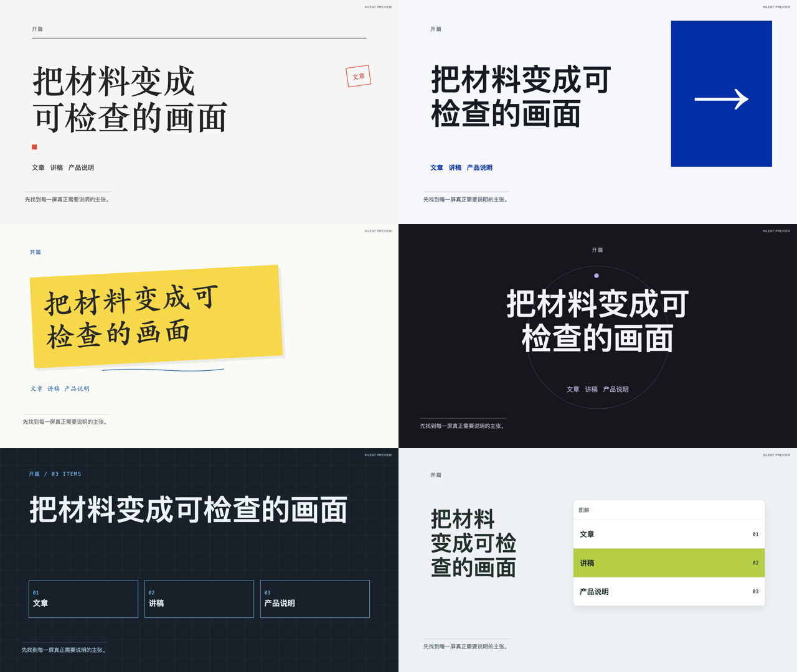
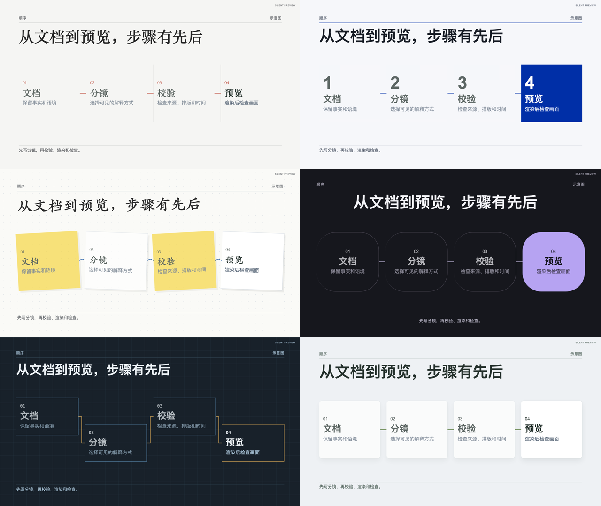

# 六套风格差异化实施

2026-10-05。参考 [guizang-ppt-skill](https://github.com/op7418/guizang-ppt-skill) 的电子杂志与瑞士设计思路，独立实现FrameLoom的六套视频语言。保留现有ID、配方集合和来源；不复制上游模板代码或媒体。

| 风格 | 主要构图 | 字体和色彩 | 入场 |
| --- | --- | --- | --- |
| 墨白杂志 / retro-zine | 杂志分栏、朱红印章 | 中文宋体、白黑红 | 横向揭示 |
| 瑞士蓝 / archive-grid | 直角色块、对齐网格 | 无衬线、克莱因蓝 | 裁切揭示 |
| 手绘便签 / scatterbrain | 倾斜便签、蓝色批注 | 中文楷体、白黄蓝 | 轻微旋转贴入 |
| 暗场信号 / signal | 中央标题、圆形焦点 | 石墨暗场、淡紫 | 克制缩放 |
| 工程蓝图 / signal-noir | 模块网格、折线路由 | 等宽标注、蓝灰与琥珀 | 模块逐项揭示 |
| 产品演示 / studio-frame | 工作台、说明与素材分区 | 无衬线、冷灰与绿色 | 窗口逐步展开 |

实际输入继续决定文字、连接、数字和素材，示意窗口只展示分镜提供的标签。字幕直接显示在画布上，captionInk随深浅画布变化。其他专用镜头保留自身构图，风格提供强调色和字体；只有已声明的组合可选。

## 复现

```bash
npm run preview:templates -- --output .tmp/style-check
npm run preview:templates -- --output .tmp/style-check-portrait --portrait --stills-only
npm run preview:library
node scripts/prepare-style-covers.mjs
npm run build:library -- --require-previews
```

公开风格视频位于 examples/template-families/previews/，封面与视频哈希在 library/style-covers/manifest.json。preview:templates 的输出须经复核后复制到对应公开视频和开篇／关系完成态文件，再重建封面；该命令不会自动发布站点。

## 已执行的验证

- 六套横屏视频由同一份2.3分镜重新渲染：1920×1080、30fps、各50.8秒、无音轨。每条视频自动QA通过，包含38份动作中途、完成态与交接证据。自动QA不代表有声成片交付批准。
- 六套风格分别经2.4原生配方渲染横竖屏各7个完成态，共84帧。检查开篇、流程、关系与素材，内容及素材保留，字幕无底板。
- 53份公开镜头／宿主／换章／变体样片重新生成；`build:library -- --require-previews`通过，卡片封面与风格视频哈希一致。
- `npm test`：22个文件、370项通过；typecheck、lint、validate:styles、validate:shots及check:docs通过。额外检查风格内容不变、按帧确定性、实际连接数量、长标题与节点溢出拒绝。
- 本地浏览器1800px桌面和390px手机页面无横向溢出；检查悬停播放、详情加载、手机详情及风格→兼容镜头→制作组合，导出保留archive-grid与semantic-default ID。

## 实际画面

对比图从左至右、从上至下为：墨白杂志、瑞士蓝、手绘便签、暗场信号、工程蓝图、产品演示。





[对照](input-compare-comparison.png) · [变化](change-comparison.png) · [收尾](closing-comparison.png) · [竖屏开篇](portrait-opening-comparison.png)

[桌面页面](library-desktop.png) · [手机页面](library-mobile.png) · [手机详情](detail-mobile.png)

字体未打包，中文宋体／楷体使用系统字体与已安装的Noto回退；其他系统的字形可能不同。风格ID与兼容清单未扩展，其他风格目前只有基础配方；网页不会将墨白杂志的专用镜头当作其他风格的已适配预览。
