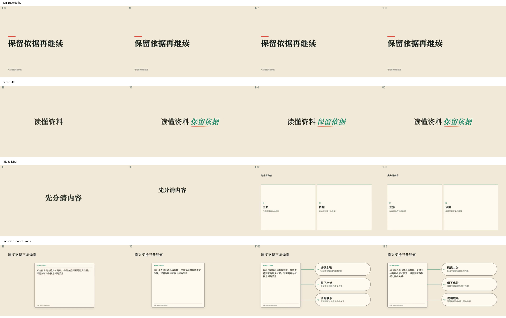
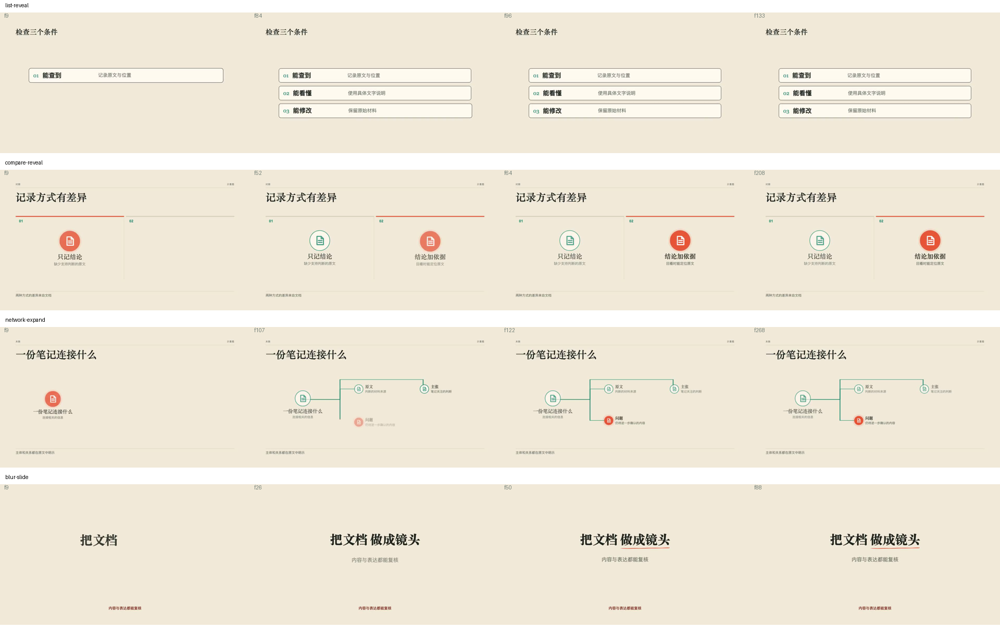
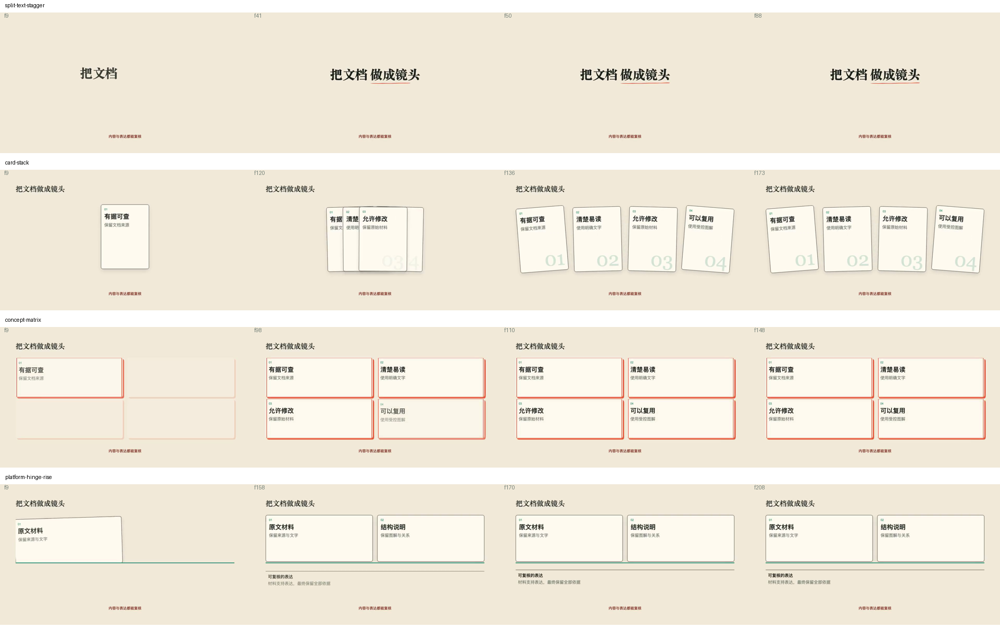
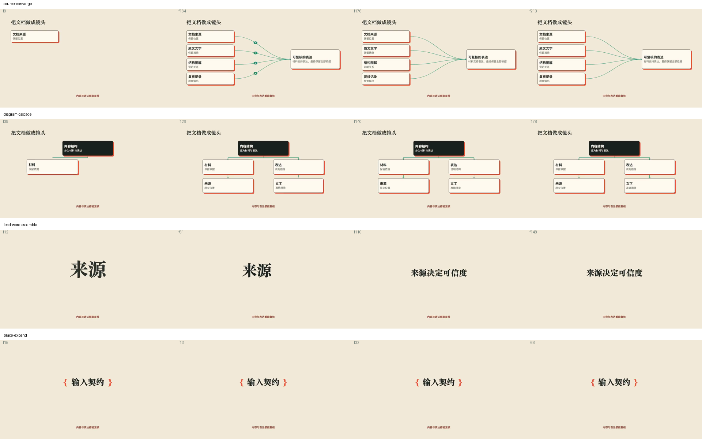
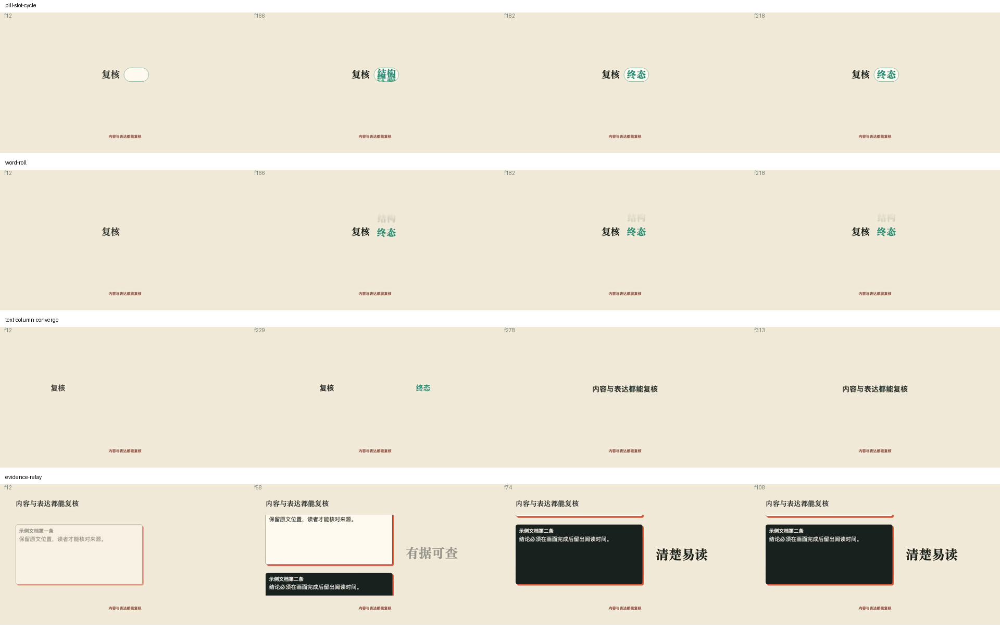
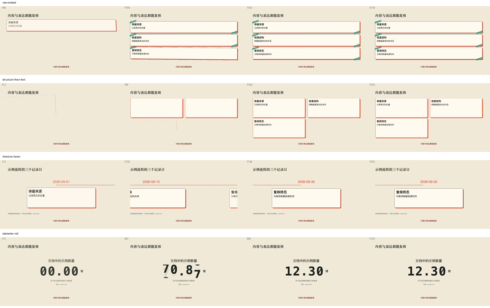
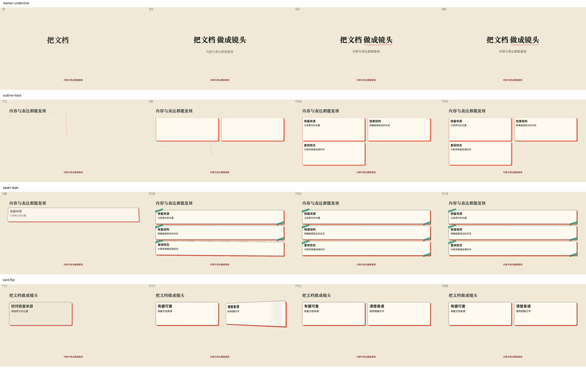
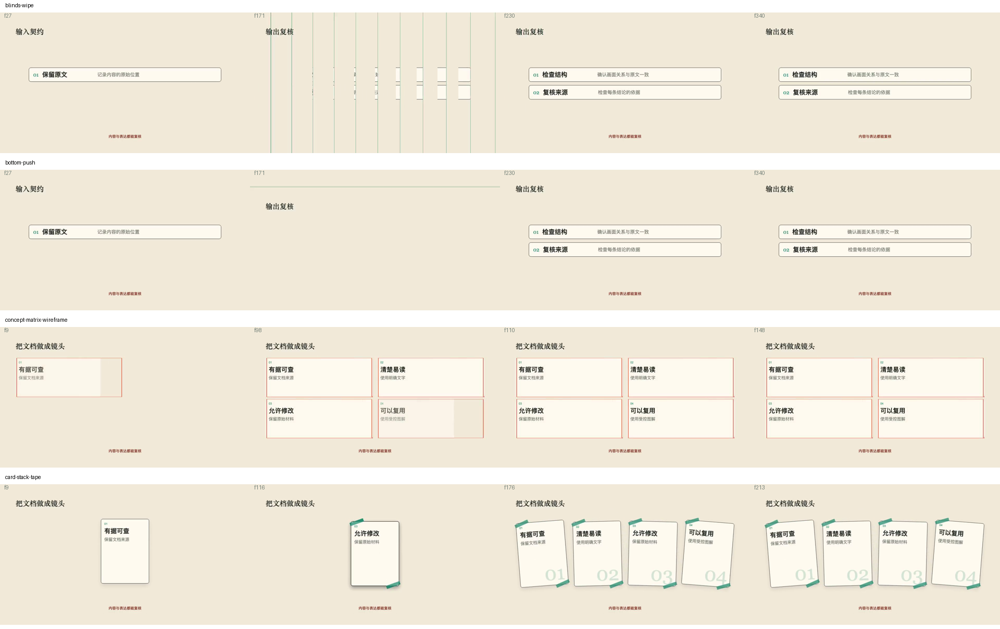
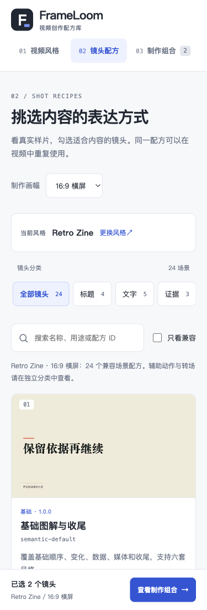

# 27份已接入配方动效复核

> 本目录保留1.1.0动效改造的历史证据与指纹。当前1.2.0视觉见[最新复核](../visual-review/README.md)，旧输出不作为当前生产批准。

2026-10-02。范围为21个上游场景、4个宿主动作和2个换章转场；3个原生场景保留。没有新增P2、用户生产项目或在线TTS调用。

实际 renderer 生成32份公开静音样片：24场景＋4辅助＋2转场＋矩阵线框与卡堆胶带两个变体。画布1920×1080、30fps，以960×540供网页播放。32份均以1倍速在Chromium中运行到 ended，另从每份视频抽取4帧并回读全部8页接触表。自动完整播放记录不代替创作者对节奏、真实旁白的最终验收；并发检查出现少量浏览器丢帧，报告保留实测值。

[帧号、播放完成与指纹记录](report.json)。接触表每行一个样片，四列为入场中途、特征动作中途、完成、结束前；转场特征帧为两章交接中点。

| 样片 | 时长（秒） | 抽帧（30fps） |
| --- | ---: | --- |
| `semantic-default` | 4.000 | 10, 9, 22, 118 |
| `paper-title` | 2.833 | 9, 37, 46, 83 |
| `title-to-label` | 4.667 | 9, 46, 101, 138 |
| `document-conclusions` | 6.500 | 9, 38, 156, 193 |
| `list-reveal` | 4.500 | 9, 84, 96, 133 |
| `compare-reveal` | 7.000 | 9, 52, 64, 208 |
| `network-expand` | 9.000 | 9, 107, 122, 268 |
| `blur-slide` | 3.000 | 9, 26, 50, 88 |
| `split-text-stagger` | 3.000 | 9, 41, 50, 88 |
| `card-stack` | 5.833 | 9, 120, 136, 173 |
| `concept-matrix` | 5.000 | 9, 98, 110, 148 |
| `platform-hinge-rise` | 7.000 | 9, 158, 170, 208 |
| `source-converge` | 7.167 | 9, 164, 176, 213 |
| `diagram-cascade` | 6.000 | 39, 126, 140, 178 |
| `lead-word-assemble` | 5.000 | 12, 61, 110, 148 |
| `brace-expand` | 2.333 | 15, 13, 32, 68 |
| `pill-slot-cycle` | 7.333 | 12, 166, 182, 218 |
| `word-roll` | 7.333 | 12, 166, 182, 218 |
| `text-column-converge` | 10.500 | 12, 229, 278, 313 |
| `evidence-relay` | 3.667 | 12, 58, 74, 108 |
| `row-embed` | 7.333 | 48, 166, 182, 218 |
| `structure-then-text` | 6.500 | 12, 46, 158, 193 |
| `timeline-travel` | 6.167 | 12, 130, 146, 183 |
| `odometer-roll` | 4.500 | 12, 63, 98, 133 |
| `marker-underline` | 3.000 | 9, 26, 50, 88 |
| `outline-trace` | 6.500 | 12, 46, 158, 193 |
| `paper-tape` | 7.333 | 48, 166, 182, 218 |
| `card-flip` | 6.333 | 12, 133, 152, 188 |
| `blinds-wipe` | 11.400 | 27, 171, 230, 340 |
| `bottom-push` | 11.400 | 27, 171, 230, 340 |
| `concept-matrix-wireframe` | 5.000 | 9, 98, 110, 148 |
| `card-stack-tape` | 7.167 | 9, 116, 176, 213 |

## 实际关键帧

















## 网页交互

实际检查了可见卡片自动播放、离屏暂停、减少动态效果时暂停、点击SVG全屏按钮、配方弹窗暂停卡片、矩阵变体切换、勾选两个镜头后跨页导出指令。辅助动作4项和换章2项仍为独立分类，不计入场景勾选集合。视频风格页只展示6种风格。

三页分别在375、768、1024、1440 CSS px检查无横向溢出。网页响应式检查不代表视频镜头支持竖屏。




## 复现

```bash
npm run preview:library
npm run build:library -- --require-previews
npm run library
```

访问本地镜头页 `/shots.html`。公开MP4位于 `library/previews/`，不作为用户生产视频，也不在此目录提交。预览指纹变化后需重渲；旧截图在旧验收目录保留，仅作历史对照。

自动检查：17个测试文件、263项通过；typecheck、lint、validate:shots、generate:schemas、check:docs、严格静态站点构建和git diff --check通过。21场景与4宿主动作使用1.1.0；1.0.0历史渲染路径可继续按精确版本解析。两个转场仍为1.0.0，已核对几何并重做可见两章内容的样例。真实旁白、其他风格和竖屏未在本轮验收，仍experimental。
