# 镜头中性底色复核

2026-10-03。范围保持27份已接入上游配方，加3个原生场景；未新增P2。覆盖24个场景、4个宿主动作、2个换章和2个已支持变体，共32份公开静音样片。

画布采用白色、冷灰和石墨色，强调色与字体由Style Pack提供；网页封面、动态样片与生产共用实际renderer。原生对照/关系图使用纯白卡片与圆角方形图标，连线位于实体卡片后方。网页卡片的分类、间距、边框与阴影也已调整。

## 实际检查

- 重新生成全部32份960×540、30fps样片与封面，源指纹：`970b7f33363326db9c9cb85f541874250d87e4bd42876f18a6a6c40e11e1dda8`。
- 每份抽取4张实际视频帧，共128帧，覆盖入场、动作过程、封面时点与结束前；32张封面及8张关键帧接触表均已回读。抽样画布角落无旧米黄底色。
- 浏览器四路并发，32份均以1倍速到达ended事件，媒体错误为0。记录78个掉帧；并发播放检查不代表逐帧无掉帧或创作者批准。
- 375/768/1024/1440宽度均无横向溢出；10种分类计数正常，镜头选择跨页进入制作指令，指令无风格/配方版本号；减少动态效果时暂停卡片自动播放。检查后原选择已恢复。
- 额外实际渲染semantic-default在已支持Signal风格上的图解，以及card-stack/list-reveal的外部字幕帧：深底浅字、浅底深字，字幕无背景底板。compare-reveal/network-expand仍仅支持retro-zine，未扩大适配范围。
- typecheck、lint、19文件283项测试、validate:shots与严格静态构建通过。

机器证据：[实际帧记录](frame-review.json)、[浏览器记录](browser-review.json)。只验收当前横屏公开样片；未调用TTS、未创建用户生产视频，真实内容、旁白与其他画幅仍需独立复核。

## 全部封面

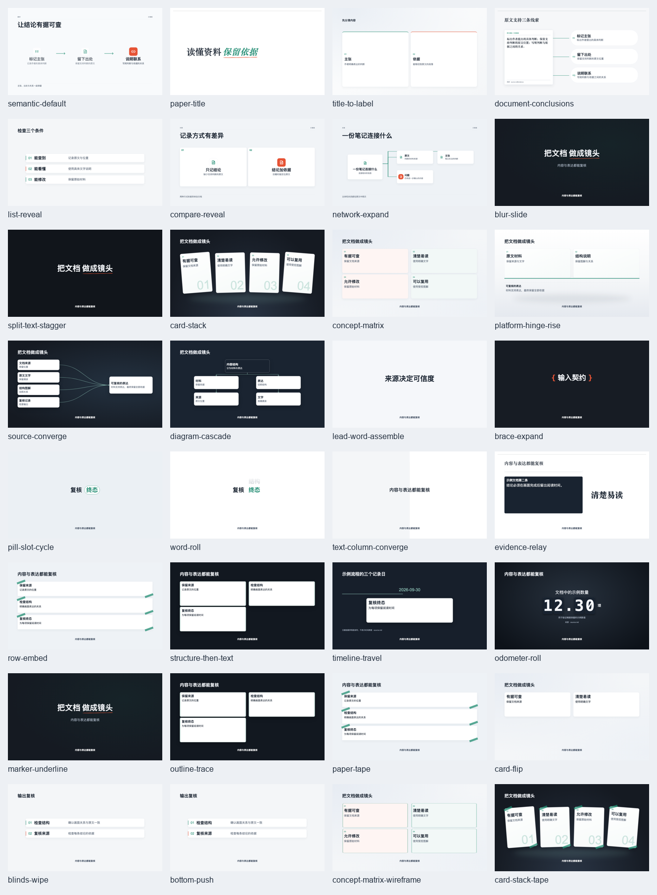

## 网页

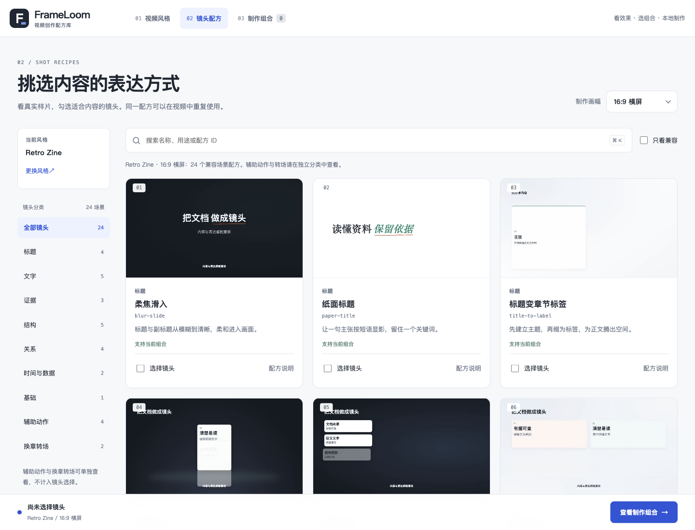

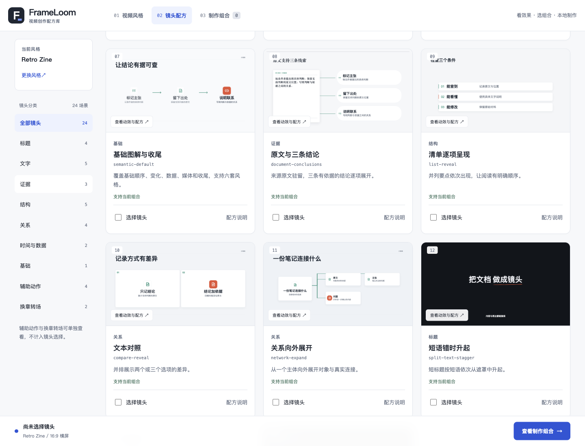

[手机镜头页](library-375.png)

## 实际视频关键帧

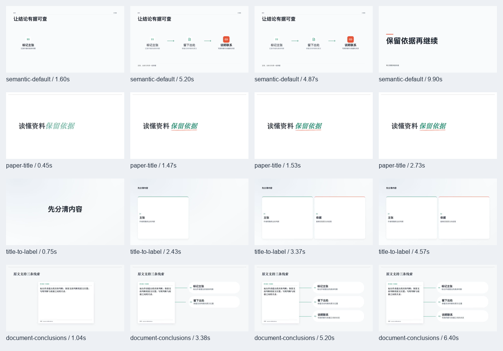

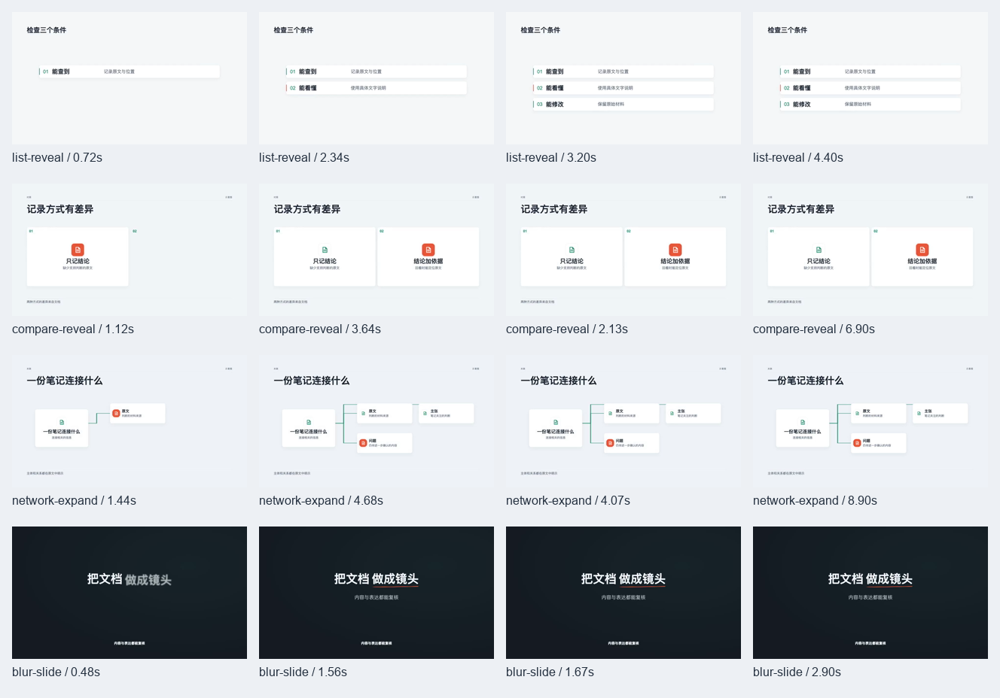

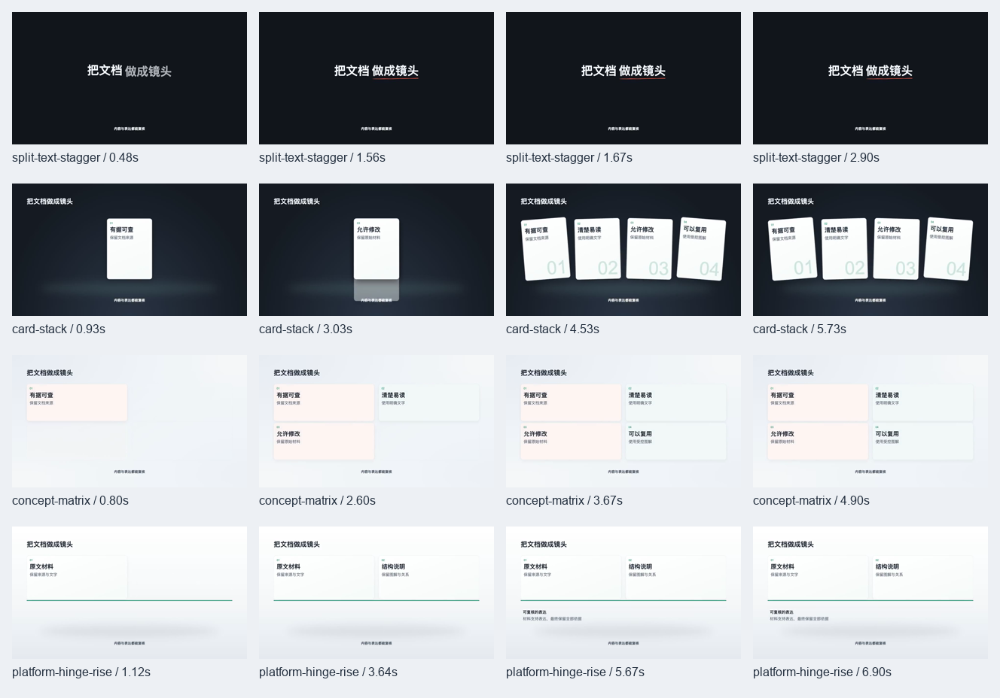

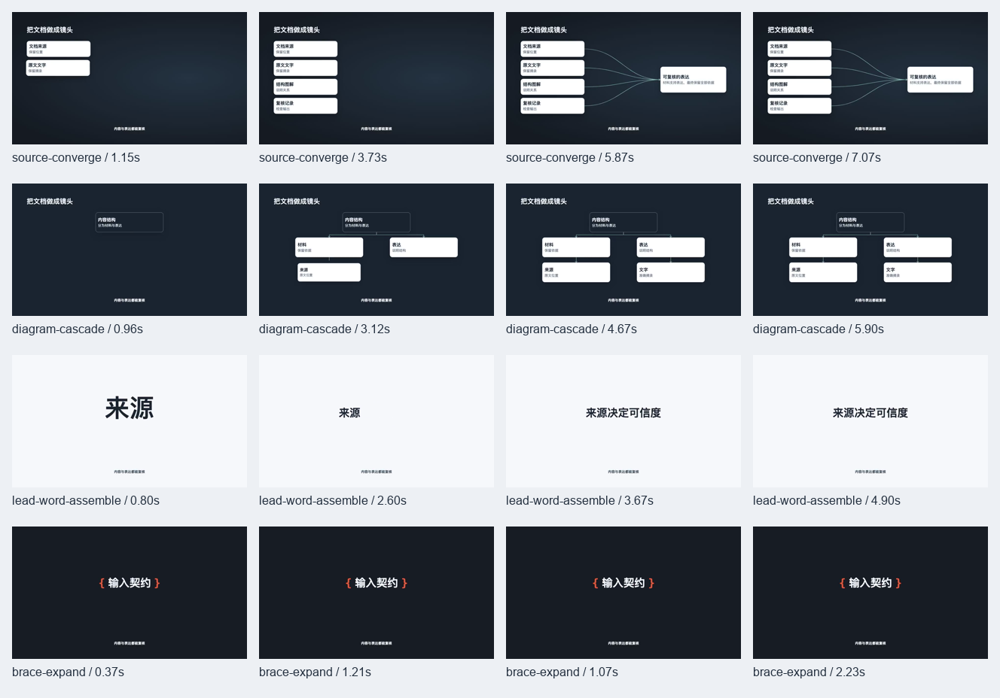

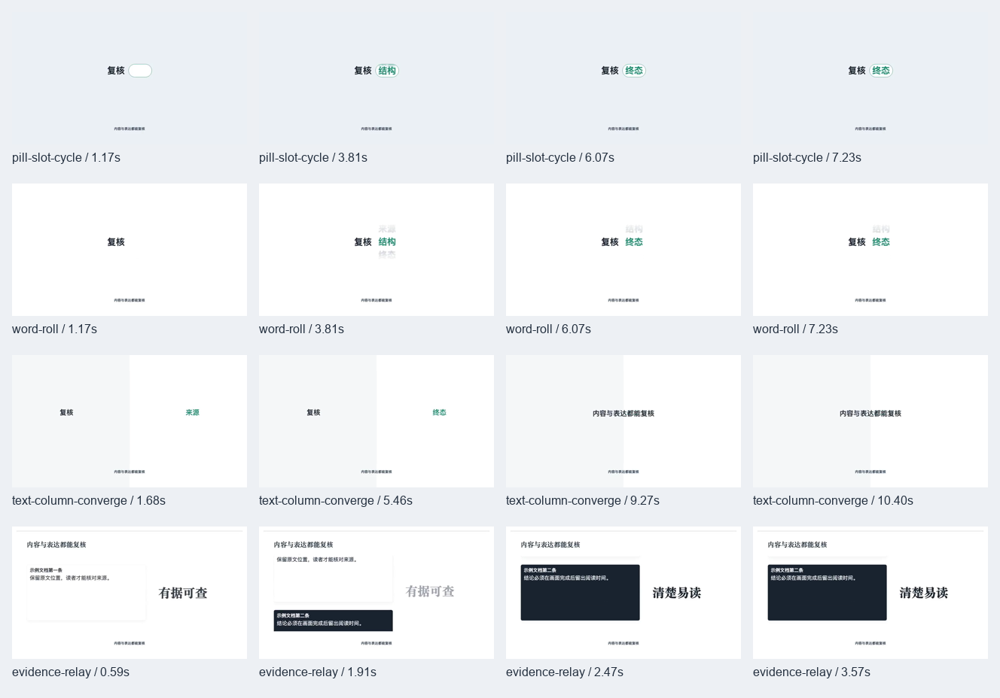

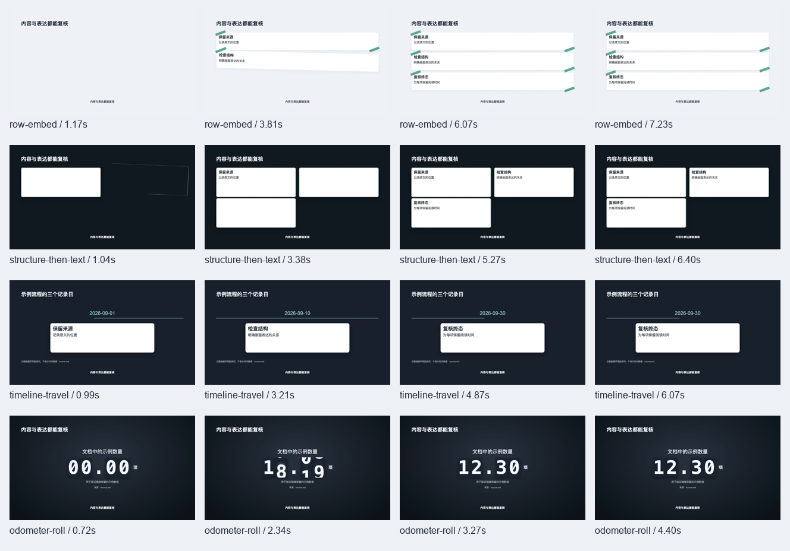

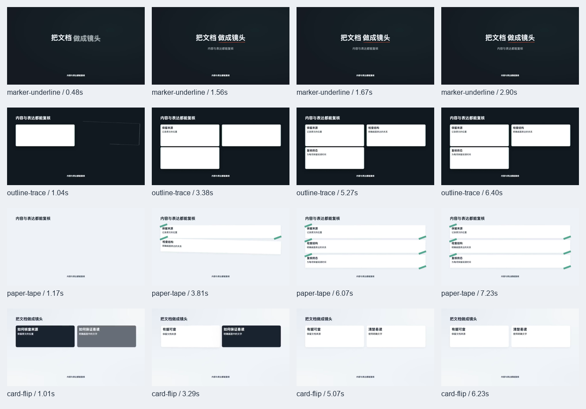

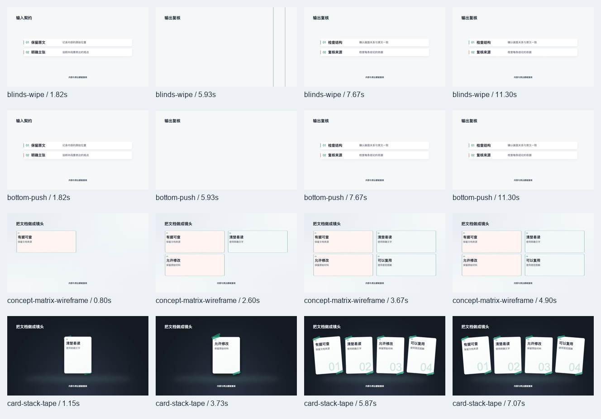

## 深浅画布文字与外部字幕

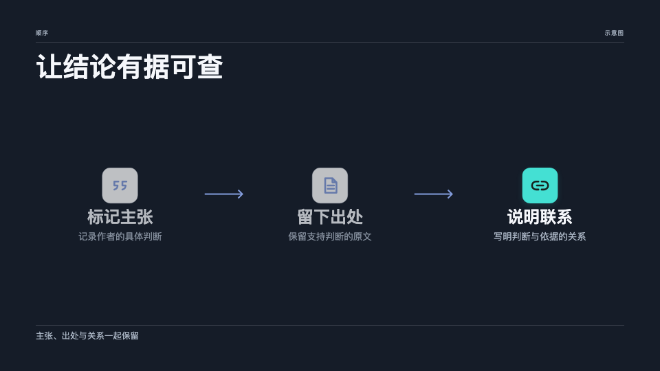

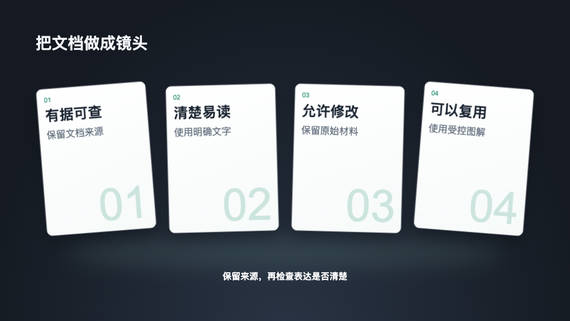

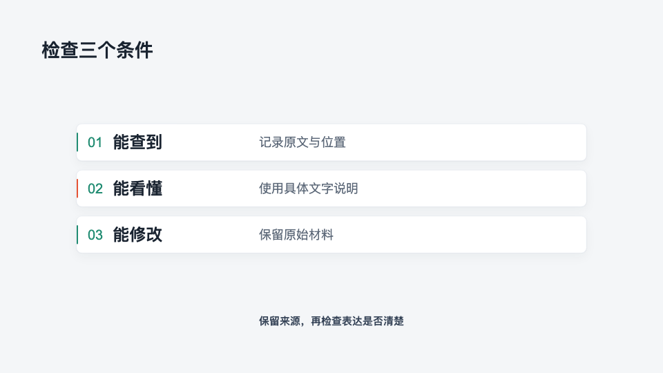
