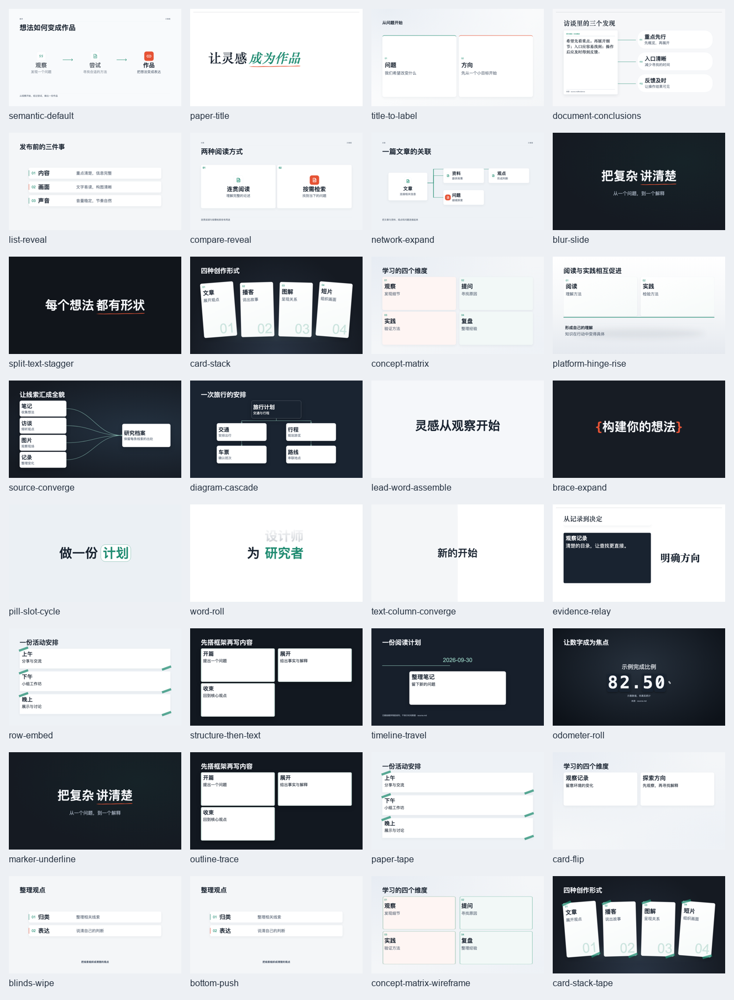
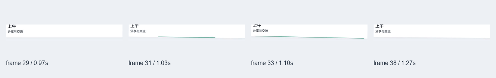
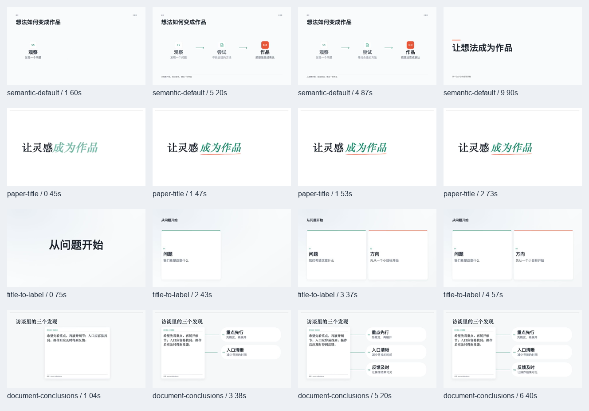
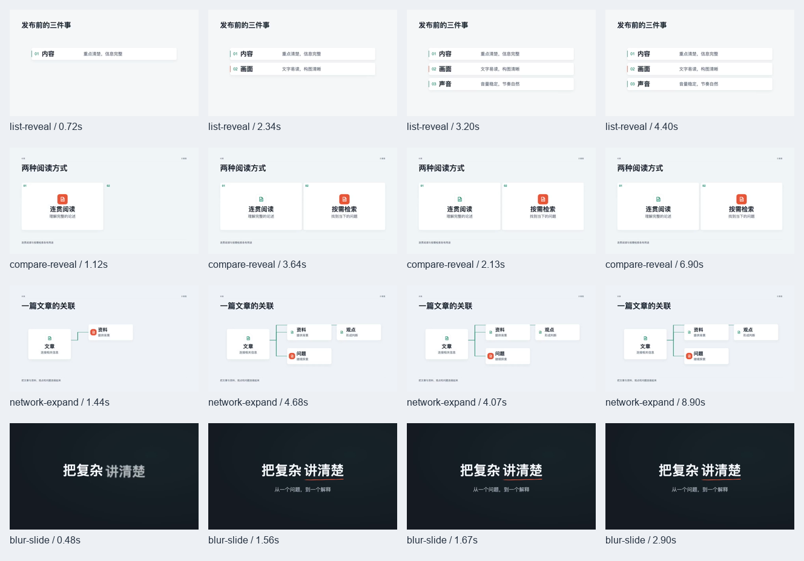
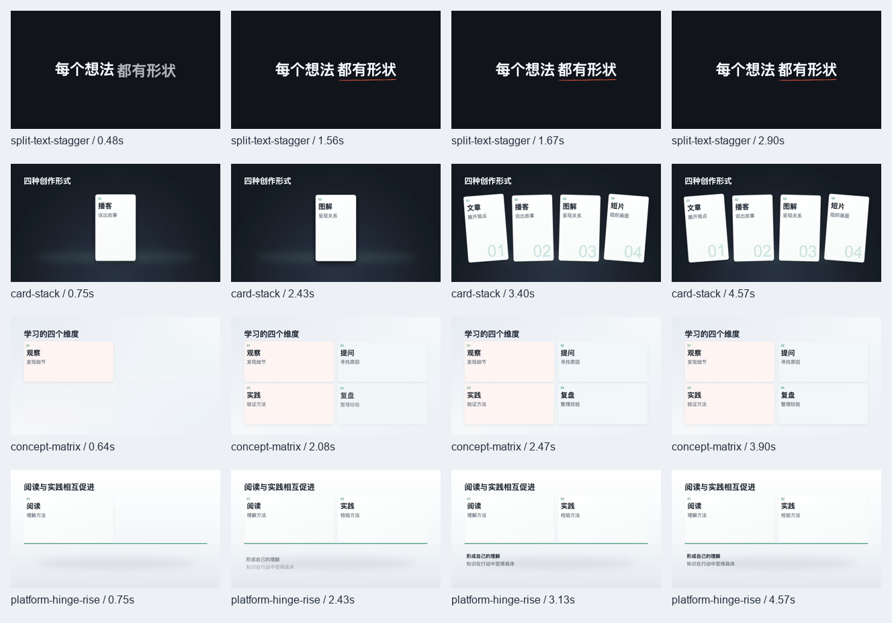
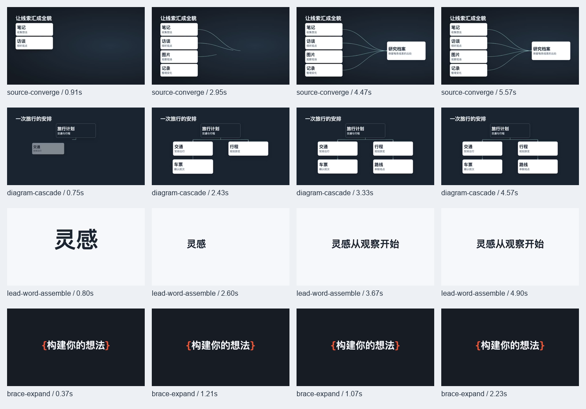
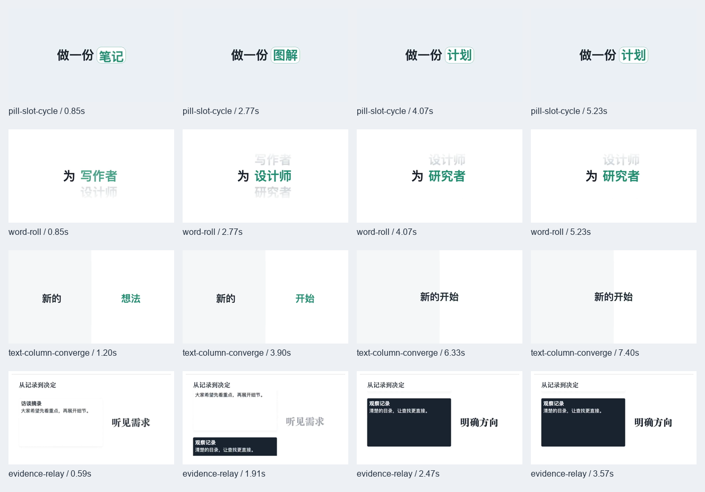
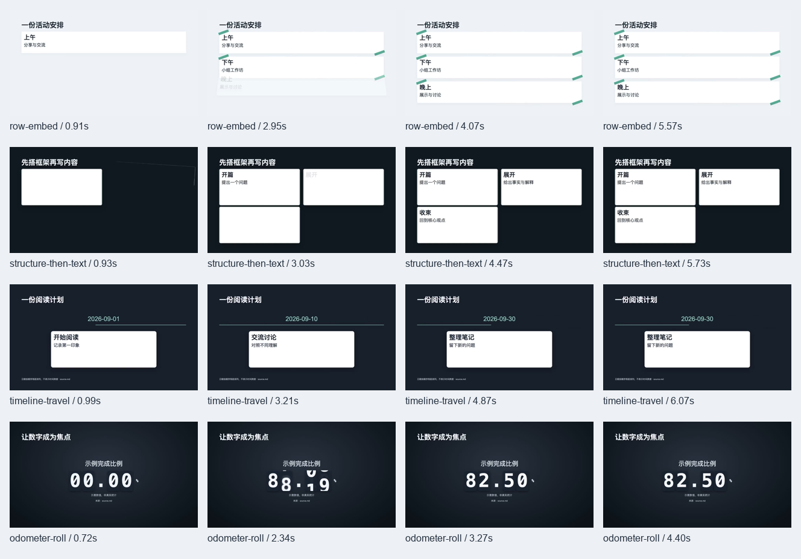
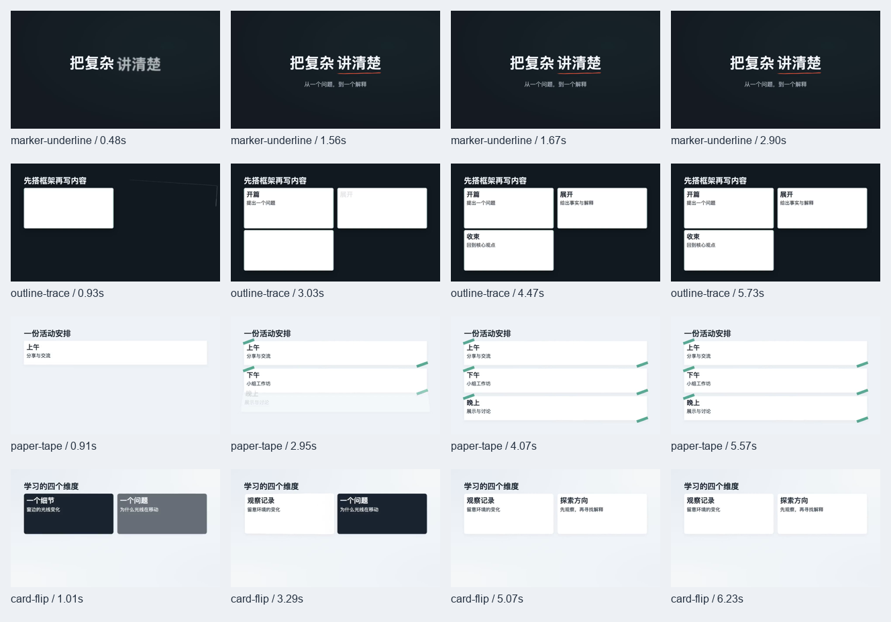
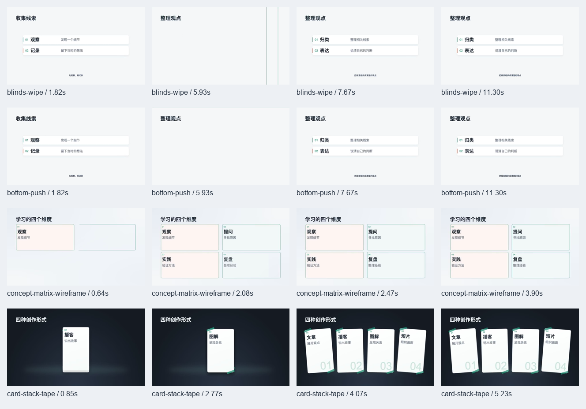

# 镜头 P1 复核

2026-10-04。范围为既有27份上游配方，加3个原生场景的展示可读性；覆盖24场景、4宿主动作、2换章与2既有变体，共32份公开静音样片。没有新增候选配方或修改用户生产项目。

## 本次变更

- 24个场景使用各自适合的公开示例：创作形式、访谈发现、旅行安排、活动清单、阅读计划等。来源随分镜保留在各目录的 `source.md`；示例为项目自写，不代表真实访谈或统计。辅助动作继承宿主内容。
- 增大主标题、卡片标题及关键词，减少主标题占用的纵向空间，让主体更清楚。文档结论与清单的长内容保留紧凑字号，渲染与文字预检使用同一规则。
- 重新安排卡堆、矩阵、汇聚、轮换和行落位等样片的节拍。平台样片证据落定到结论启动从3.4秒缩短到约0.7秒；生产分镜仍按内容和旁白安排，不强套样片时长。
- 行嵌入强调缝在落定后从中心展开，按30fps换算5帧展开、8帧消退，裁切在圆角卡片内部；随机seek不依赖播放历史。
- 修正括号标题误用领词2.3倍放大边界判断。公开场景样片不再叠加重复旁白字幕；生产字幕能力及安全区保留。

## 实际检查

- 32份实际renderer视频与封面，960×540、30fps；源指纹：`c67ec59faae5f676ebbf0f097cec149578685879561ec33107ad39bf6f533e5f`。
- 检查32张封面及128张实际视频关键帧，并额外抽查行落定前、展开中、消退后的帧。
- 实际渲染深浅场景外部字幕及已支持Signal基础图解。字幕直接显示，无背景底板，主体未侵入字幕区域。
- typecheck、lint、20文件288项测试、validate:shots及严格静态构建通过。

- 浏览器四路并发，32份均以1倍速到达ended事件，媒体错误为0；记录196个掉帧。此检查不等于逐帧无掉帧或创作者完整播放审批。
- 桌面1440与手机375宽度无横向溢出，24场景卡片正常加载，可视样片自动播放；详情弹窗实际播放正常。未改变原有风格选择、镜头勾选和制作指令流程。

[正常播放记录](playback.json)、[网页检查记录](browser-review.json)。本记录只针对公开横屏展示，不涉及真实TTS配合或用户成片审批。

[手机镜头页](library-375.png)、[详情播放器](detail.png)

[深色外部字幕](caption-card-stack.png)、[浅色外部字幕](caption-list-reveal.png)、[Signal基础图解](signal-semantic-default.png)

## 全部封面

## 行落位反馈

## 实际视频关键帧

[帧采样记录](frame-review.json)
