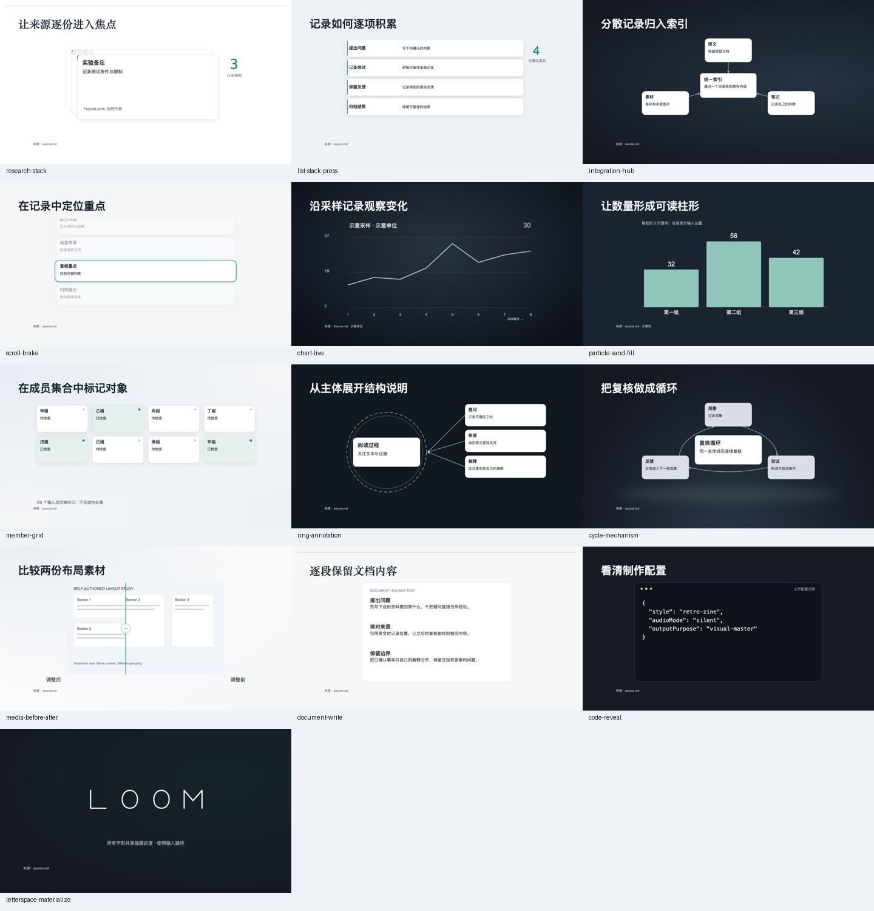
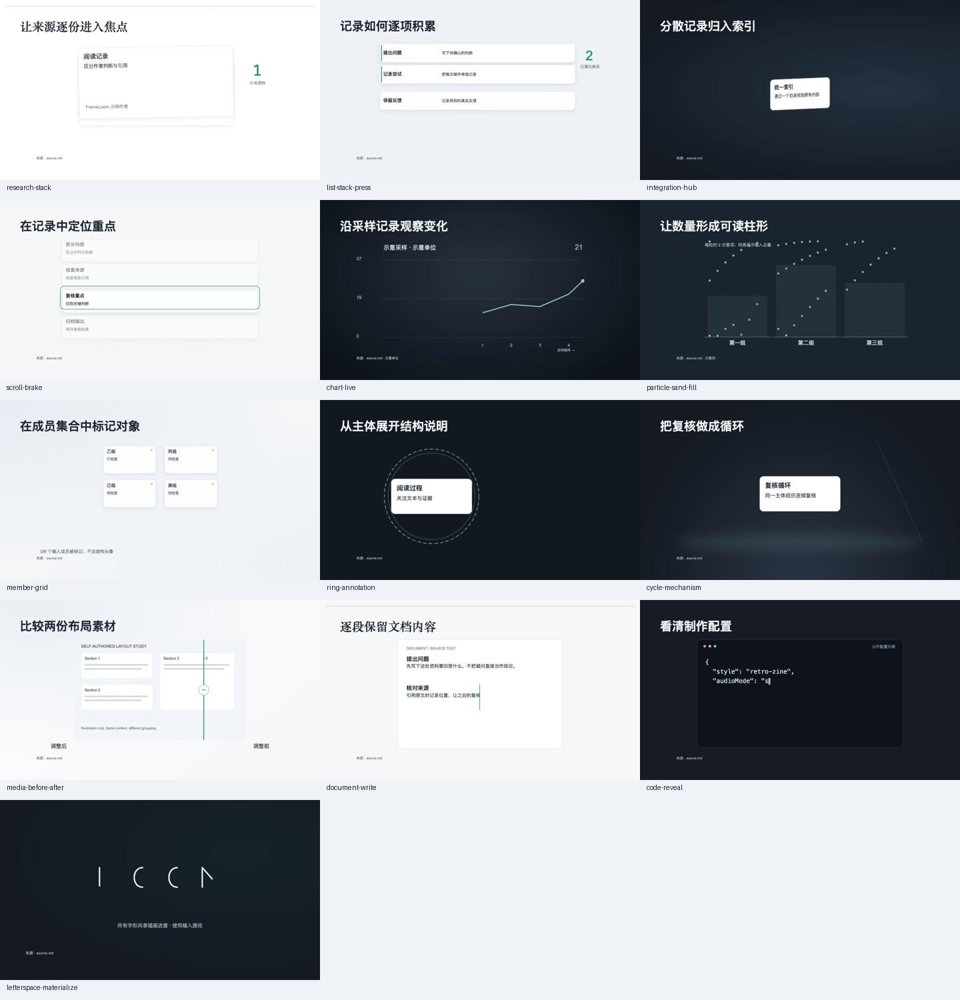
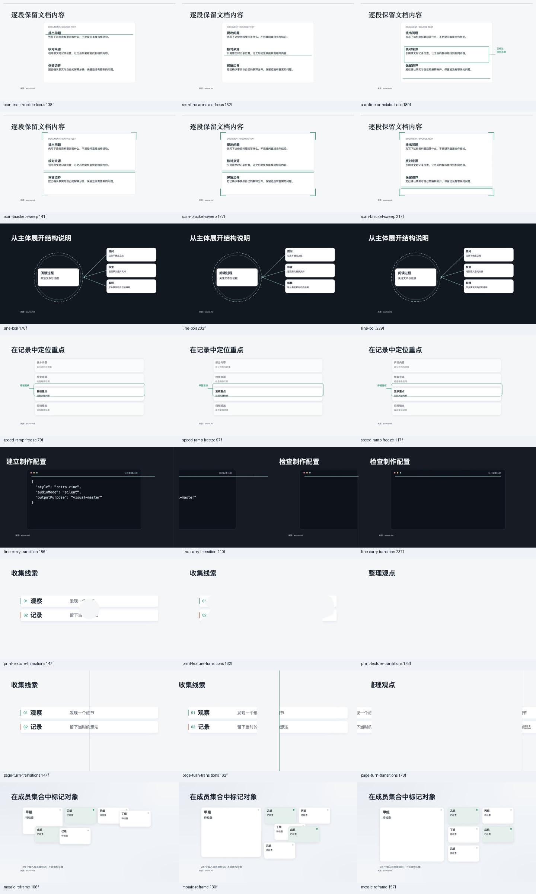

# P2 配方复核记录

2026-10-04。新增21份P2：13个场景、5个受控宿主动作、3个换章转场。全部候选覆盖48/48；场景库37入口，其中34来自筛选清单、3为原生场景。家族仅适配台账中声明的变体，不能用覆盖数表示所有上游变体都已实现。

本轮验证retro-zine、16:9公开静音样例。内容、作者、成员、数据与前后SVG素材均为自写示意，明确标注来源；没有制作用户成片或调用在线TTS。P2仍为experimental。

## 实际执行

- typecheck、lint、完整21文件350项测试、目录校验、schema导出和文档链接检查通过。
- 21个新fixture通过来源、素材、文字槽位、安全区、阶段与严格输入预检；53份公开样片实际渲染，并通过 `build:library -- --require-previews` 构建。
- 13个场景各保存过程/完成帧，8个辅助与换章各保存3个窗口帧，共50帧，接触表已回读。检查修复节点关系线穿过正文、对开换章新页提前遮住旧页两处问题。
- 新增21样片在隔离浏览器顺序以1倍速播放到ended；各批次统计见 [0–4](playback-0.json)、[5–9](playback-5.json)、[10–14](playback-10.json)、[15–19](playback-15.json)、[20](playback-20.json)。这些记录证明样片可正常播放，不等于创作者的审片批准。
- 网页检查场景总数、P2搜索、勾选后跨页保留、制作指令包含新配方且不带版本号、配方详情播放及独立辅助/转场分类；390px手机页面无横向溢出，1440px桌面检查另留截图。
- 两个公开fixture还使用生产渲染入口输出1920×1080、30fps预览：素材对照7.2秒、线条承接14秒，自动QA均通过。分别保存15/25个QA帧接触表与报告；报告的临时视频路径仅表示本地执行位置，文档和截图均在此目录独立保存。`releaseReady` 仍为false。

样片源指纹：`2c4bff885a3846709160f49487d4302965d5a1a0ea64ce628e2725d8f51980b9`。机器汇总见 [report.json](report.json)，配方槽位与限制见[配方目录](../../../shots/README.md)。

## 画面证据







[手机页面](mobile.png) · [桌面页面](desktop.png) · [配方详情](detail.png)

[素材对照生产QA](media-production-qa.json) · [对应实际帧](media-production-qa.png)

[线条承接生产QA](carry-production-qa.json) · [对应实际帧](carry-production-qa.png)

## 复现

```bash
npm run typecheck
npm run lint
npm test
npm run validate:shots
npm run preview:library
npm run build:library -- --require-previews
npm run library
```

真实旁白、其他Style Pack、竖屏、创作者对节奏与美观的最终认可仍需另行验收。前后素材同视角及数据、作者、关系的事实真实性需要制作人提供证据；自动校验不代替事实审核。
