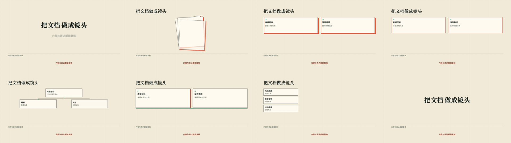
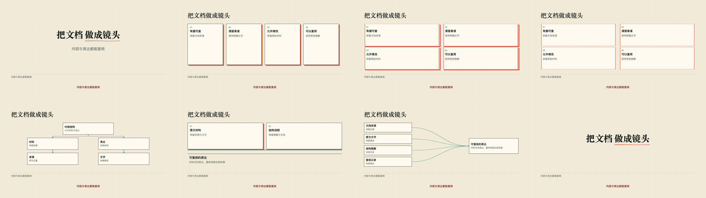

# 首批12项的新增镜头静态验证

2026-09-30：对7个新增场景与概念矩阵的第二变体，用真实 Remotion composition 渲染24张1920×1080关键帧，回读中途、完成和交接画面。仅检查静态构图、阶段与文字；没有生成新的生产视频或调用在线TTS，正常速度与真实旁白待验证。

接触表按行：blur-slide、card-stack、concept-matrix/BentoLightUp、concept-matrix/WireframeDrawOn；diagram-cascade、platform-hinge-rise、source-converge、split-text-stagger。

检查到裂升宿主的下划线被裁切，调整实际字号下的遮罩留白后重新渲染；最终标题、图解和字幕没有互相覆盖。卡堆正文在展开后阅读，终态去除透视与叠压；矩阵描线后填入文字；汇聚保留来源，层级按父先子后建立。

契约及错误路径见 tests/shortlist-recipes.test.mjs；候选状态和未接入项见 [shortlist-coverage.json](../../../shots/shortlist-coverage.json)。
