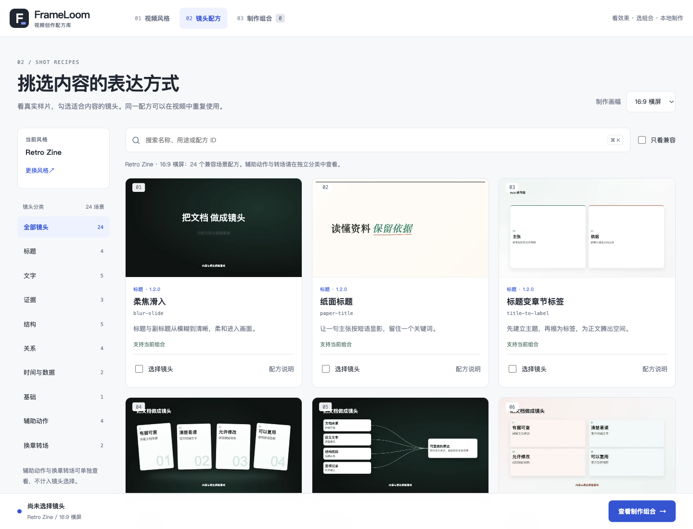
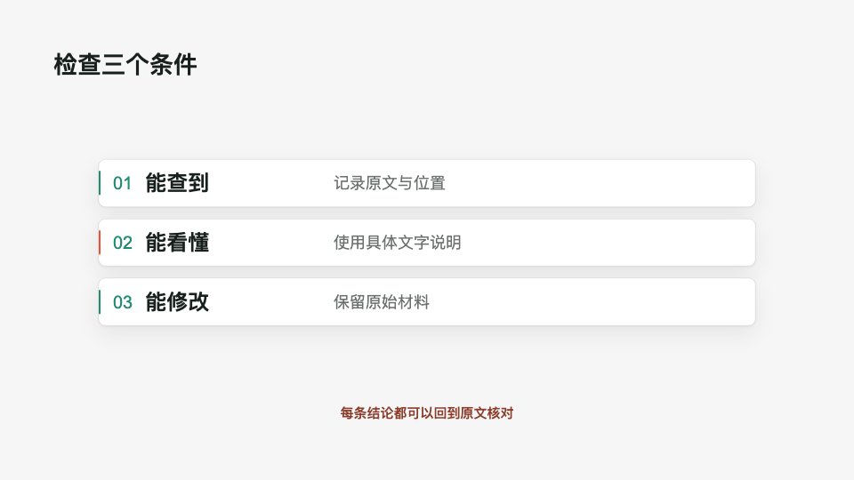
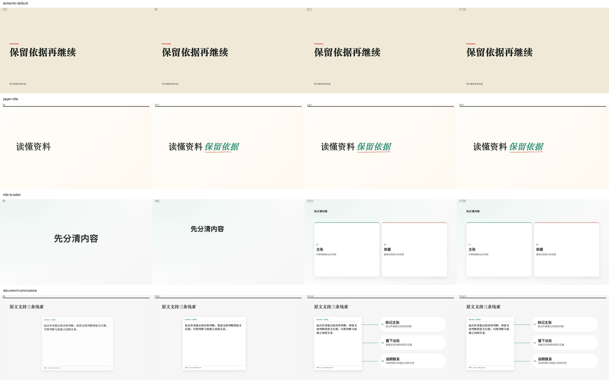
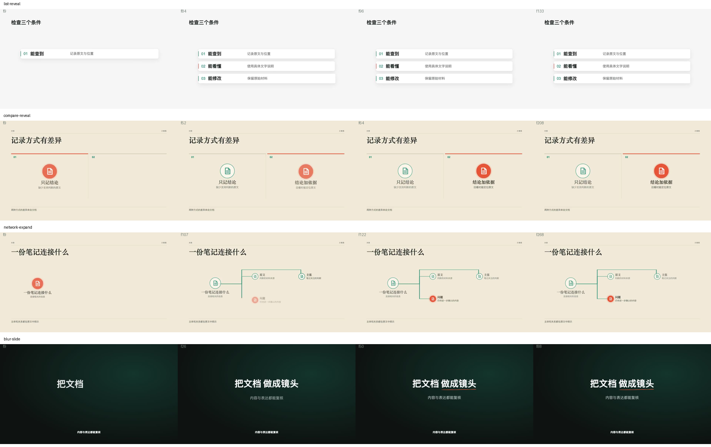
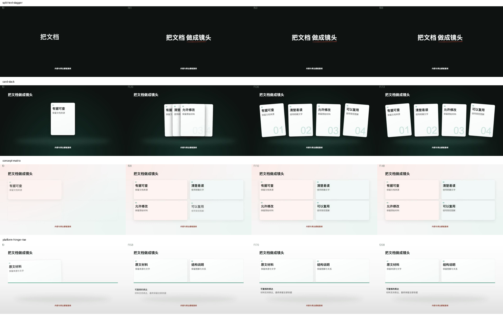
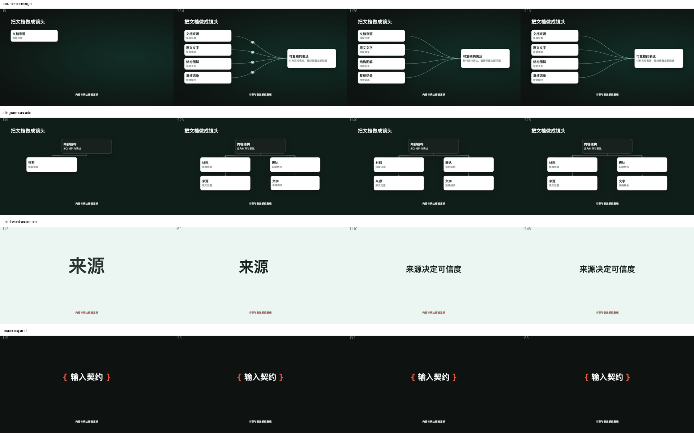
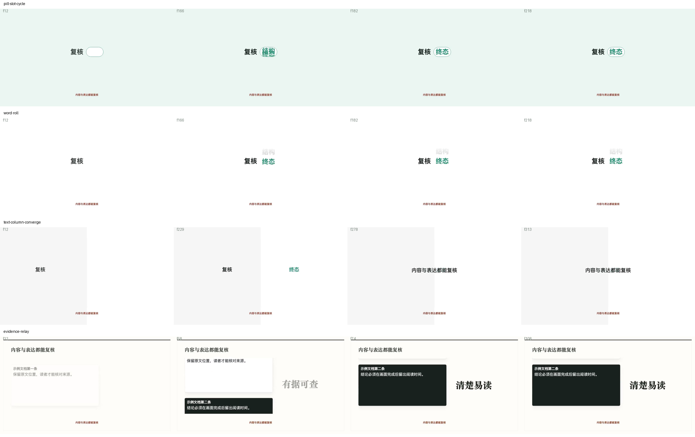
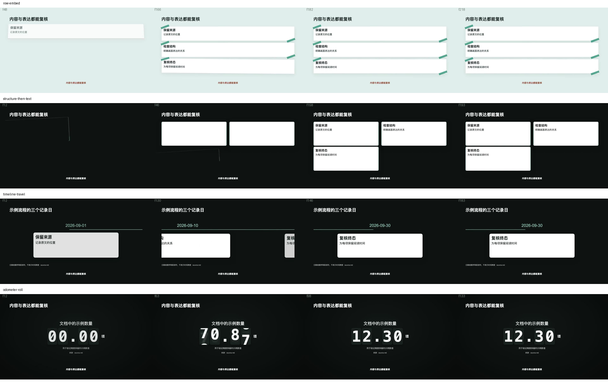
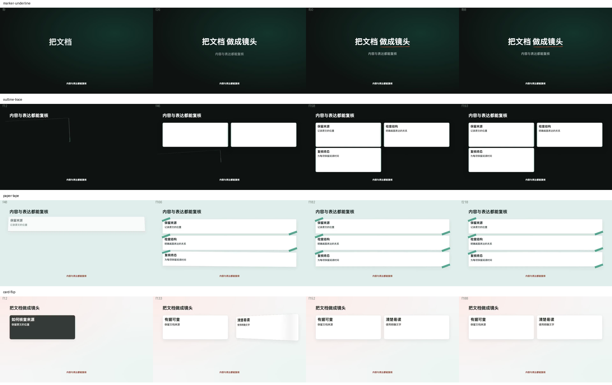
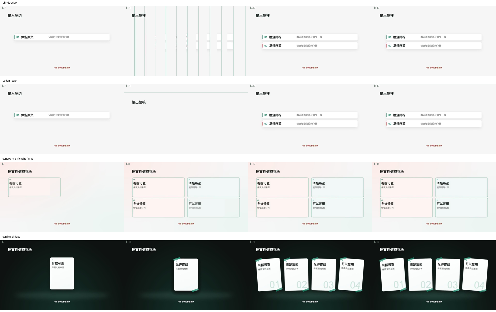

# 1.2.0 镜头视觉复核

2026-10-02；27份既有上游配方范围不变：21场景与4宿主动作升级1.2.0，2换章保持1.0.0；另保留3原生场景。未新增P2。当前只验收retro-zine@1.0.0、16:9公开静音样例，状态experimental。

网页与生产共用实际renderer，不使用另画的封面冒充动效。深色柔光、纸面、白卡、浅色矩阵和仪表分别服务于不同表达；[逐配方视觉方案](../../../references/shot-visual-redesign.md)。

当前样片源指纹：`c3bdeb84056e9820751c55758c2939eeb335db358b432f22936894d0ce2a6007`。机器记录见[report.json](report.json)，与1.1.0的[motion-review](../motion-review/README.md)分开保存。

## 实际检查

- 32份样片真实渲染：24场景、4宿主动作、2换章、2已注册变体；960×540、30fps。
- 每份抽取4张实际MP4帧，共128帧，覆盖动作过程、完成与结束前；8张接触表已回读检查。
- 浏览器4路并发，以1倍速播放至32个ended事件，无媒体错误；记录decoded与dropped统计。并发播放存在掉帧，不能据此声称逐帧无掉帧或创作者审片批准。
- 实际渲染深浅背景外部字幕帧，确认无底板、深底白字与浅底深字、安全区及卡片正文可读。
- 网页检查：全屏、卡堆胶带/矩阵线框切换、勾选后跨页导出命令、风格页仅展示6套风格、减少动态效果时暂停；375/768/1024/1440宽度均无横向溢出。测试后恢复原选择。
- typecheck、lint与18文件266项测试通过；新增测试覆盖1.1精确版本与宿主锁、21场景正文/字幕对比度、外部字幕跨镜及倒退seek。

## 当前网页



[手机镜头页](library-375.png)

## 外部字幕

字幕使用同一公开文案，无音频文件，不调用TTS；此处只检查字幕渲染。




## 实际视频关键帧

| 样例 | 时长（秒） | 抽取帧 | 正常速度播放 |
| --- | ---: | --- | --- |
| `semantic-default` | 4.00 | 10, 9, 22, 118 | ended |
| `paper-title` | 2.83 | 9, 37, 46, 83 | ended |
| `title-to-label` | 4.67 | 9, 46, 101, 138 | ended |
| `document-conclusions` | 6.50 | 9, 38, 156, 193 | ended |
| `list-reveal` | 4.50 | 9, 84, 96, 133 | ended |
| `compare-reveal` | 7.00 | 9, 52, 64, 208 | ended |
| `network-expand` | 9.00 | 9, 107, 122, 268 | ended |
| `blur-slide` | 3.00 | 9, 26, 50, 88 | ended |
| `split-text-stagger` | 3.00 | 9, 41, 50, 88 | ended |
| `card-stack` | 5.83 | 9, 120, 136, 173 | ended |
| `concept-matrix` | 5.00 | 9, 98, 110, 148 | ended |
| `platform-hinge-rise` | 7.00 | 9, 158, 170, 208 | ended |
| `source-converge` | 7.17 | 9, 164, 176, 213 | ended |
| `diagram-cascade` | 6.00 | 39, 126, 140, 178 | ended |
| `lead-word-assemble` | 5.00 | 12, 61, 110, 148 | ended |
| `brace-expand` | 2.33 | 15, 13, 32, 68 | ended |
| `pill-slot-cycle` | 7.33 | 12, 166, 182, 218 | ended |
| `word-roll` | 7.33 | 12, 166, 182, 218 | ended |
| `text-column-converge` | 10.50 | 12, 229, 278, 313 | ended |
| `evidence-relay` | 3.67 | 12, 58, 74, 108 | ended |
| `row-embed` | 7.33 | 48, 166, 182, 218 | ended |
| `structure-then-text` | 6.50 | 12, 46, 158, 193 | ended |
| `timeline-travel` | 6.17 | 12, 130, 146, 183 | ended |
| `odometer-roll` | 4.50 | 12, 63, 98, 133 | ended |
| `marker-underline` | 3.00 | 9, 26, 50, 88 | ended |
| `outline-trace` | 6.50 | 12, 46, 158, 193 | ended |
| `paper-tape` | 7.33 | 48, 166, 182, 218 | ended |
| `card-flip` | 6.33 | 12, 133, 152, 188 | ended |
| `blinds-wipe` | 11.40 | 27, 171, 230, 340 | ended |
| `bottom-push` | 11.40 | 27, 171, 230, 340 | ended |
| `concept-matrix-wireframe` | 5.00 | 9, 98, 110, 148 | ended |
| `card-stack-tape` | 7.17 | 9, 116, 176, 213 | ended |

















## 复现入口

```bash
npm run typecheck
npm run lint
npm test
npm run validate:shots
npm run preview:library
npm run build:library -- --require-previews
npm run library
```

`preview:library`只在公开样片源指纹变化时重新渲染；网页使用相对路径静态产物。本轮未渲染用户生产视频、未调用TTS。真实旁白、音画配合、其他风格与竖屏须单独验收，仍未批准为stable。

## 基础配方补充复核

上述表格和拼图保留首次复核快照。基础配方公开样片随后修复为10秒的顺序图解与收尾，标题与结论恢复入场，网页卡片封面改为图解完成态。最新关键帧、完整播放与逐帧结果见[基础配方验证记录](../../../shots/semantic-default/preview.md)。全部公开样片已按当前源码指纹重新渲染，内部记录的历史快照不作为当前网页预览。
