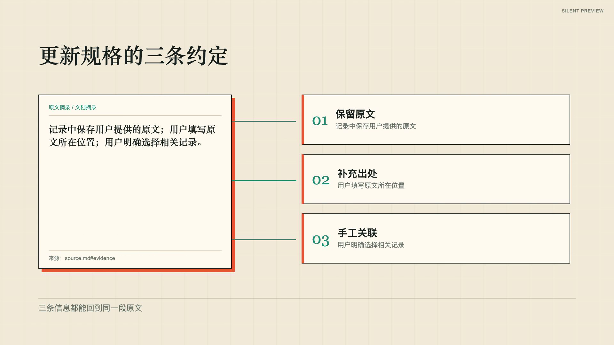
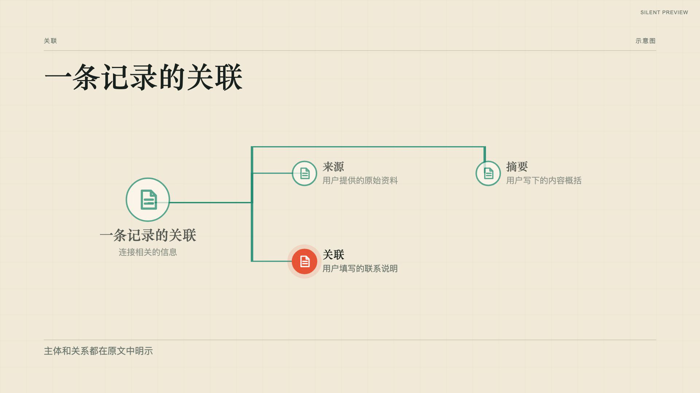

# 演示笔记工具的更新说明

[原始示例文档](source.md) → [镜头选择依据](shot-map.md) → [2.4 分镜](storyboard.json)。自有文本与图解，不需要私有素材或录屏。

渲染：`npm run render:storyboard -- examples/video-templates/product-update/storyboard.json .tmp/product-update.mp4 --mode fast`。然后用 `qa:storyboard` 生成每场动作中途、交接、完成态和切镜前证据；自动 QA 不代表完整播放已经通过。

## 实际渲染证据

52 秒、1920×1080、30 fps 静音整片完成自动 QA（84 帧／两页接触表）。这里保留自有示例的[事件时间与帧索引](previews/frames.json)，完整播放仍待人工审片。

