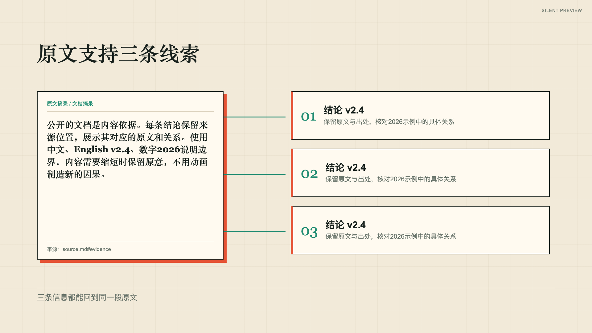

# document-conclusions 验证记录

状态 experimental。已渲染公开自有文档，检查动作中途、阶段结束、完成态和切镜前事件；模板与声音验证缺口见[首套模板记录](../../video-templates/retro-zine-explainer/preview.md)。

[边界 fixture](../../examples/shot-recipes/boundaries/storyboard.json)的1.0.0历史完成帧，采用中文、English 和数字检查排版。

2026-10-02（1.1.0历史动效）：公开样片已按最新实际renderer重新渲染、抽取关键帧回读，并以1倍速在浏览器运行到结束。见[32份公开样片复核记录](../../examples/shot-recipes/motion-review/README.md)。卡片与配方详情可动态播放；真实旁白与竖屏未在本轮验收，仍experimental。

当前1.2.0采用独立场景视觉和材质，32份静音样片已重新渲染并检查关键帧、正常速度播放与页面交互；见[当前视觉复核](../../examples/shot-recipes/visual-review/README.md)。历史截图不作为当前版本证据。
