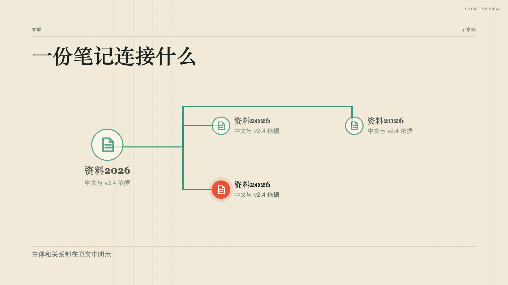
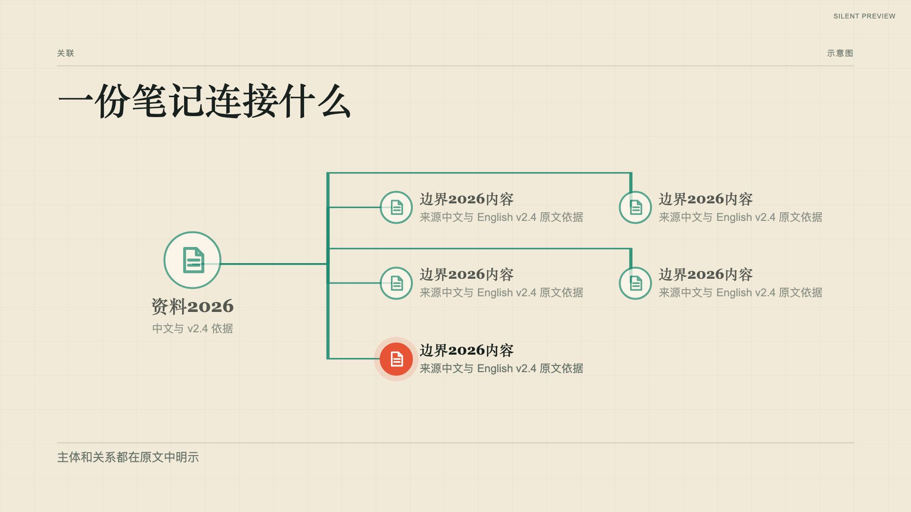

# network-expand 验证记录

状态 experimental。已渲染公开自有文档，检查动作中途、阶段结束、完成态和切镜前事件；模板与声音验证缺口见[首套模板记录](../../video-templates/retro-zine-explainer/preview.md)。

[边界 fixture](../../examples/shot-recipes/boundaries/storyboard.json)的实际完成帧，采用中文、English 和数字检查排版。

[五分支 fixture](../../examples/shot-recipes/boundaries/network-five.json)与最大条目数实际完成帧；新版分区布局及折线避让，旧版径向布局保留。

