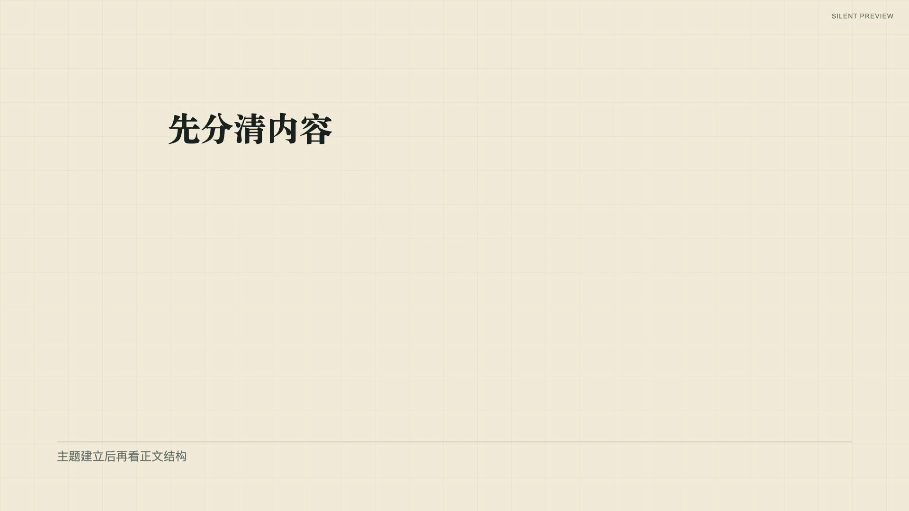
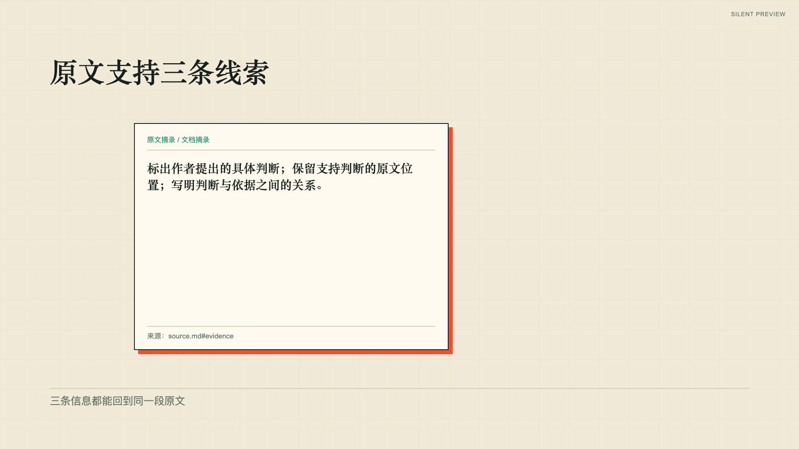

# retro-zine-explainer 验证记录

状态 experimental；尚未获得创作者正常速度完整播放复核。当前支持范围为 retro-zine + 16:9，其他风格和竖屏未声明支持。实施阶段及检查结果见[实施记录](../../references/video-template-refactor-status.md)。

2026-10-02当前预设及上游场景配方为1.2.0，包含独立场景背景与材质。单配方公开样片检查见[当前复核](../../examples/shot-recipes/visual-review/README.md)，1.1.0动效证据见[历史记录](../../examples/shot-recipes/motion-review/README.md)。下文52秒整片、录音和截图属于1.0.0历史证据，不作为1.2.0整片的QA或交付批准。

两份公开自有文档均已渲染 52 秒静音整片，分别覆盖六种场景与基础收尾。自动 QA 各抽取 84 帧、两页接触表，覆盖逐动作中途、阶段结束、完成态与切镜前。每份示例保留 2.3 对照分镜；资料笔记旧版整片和原用户文档结论旧镜头也已实际渲染，新旧正常速度观看判断仍待完成。

[资料笔记完成帧与事件索引](../../examples/video-templates/knowledge-notes/README.md)、[演示产品更新完成帧与事件索引](../../examples/video-templates/product-update/README.md)为最终公开证据，以下为关键阶段的实际截图。

同讲稿的真实声音对照复用已有豆包逐场录音并按实测时长生成时间提案。当前会话缺少豆包环境变量，未发起新的在线合成。字幕为句级估算，没有声称逐词对齐；最终发音、正常速度节奏和完整音画播放仍需创作者复核。

镜头变化用于内容：纸面标题建立主张，标题降格保留章节定位，文档驻留把三条线索与原文联系，清单保留并列关系。对照与网络使用FrameLoom原生语义构图；四个新配方的借鉴与省略见各自provenance。自动通过不提升为stable，也不代替release-ready批准。

## 文本边界

逐一检查了六种镜头的完整分辨率完成帧；以下链接均为实际渲染图片，采用自有中文／English／数字验证文案。

| 镜头 | 证据 |
| --- | --- |
| paper-title | [短语与划线](../../examples/shot-recipes/paper-title/previews/boundary.png) |
| title-to-label | [主题降格后正文](../../examples/shot-recipes/title-to-label/previews/boundary.png) |
| document-conclusions | [原文驻留与三条结论](../../examples/shot-recipes/document-conclusions/previews/boundary.png) |
| list-reveal | [四条清单](../../examples/shot-recipes/list-reveal/previews/boundary.png) |
| compare-reveal | [原生两项对照](../../examples/shot-recipes/compare-reveal/previews/boundary.png) |
| network-expand | [三分支](../../examples/shot-recipes/network-expand/previews/boundary.png)、[五分支](../../examples/shot-recipes/network-expand/previews/five-items.png) |

网络边界复核发现中心与第三分支重叠，已在新版镜头中改为分区及折线避让；旧版径向布局保留。边界静态检查与自动 QA 不证明全片节奏或音频质量已通过。
